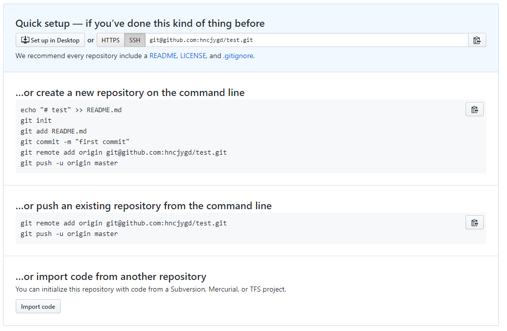

[toc]
# Git教程
Git是目前使用最广泛的分布式版本控制系统。

## 初始化工作
安装git，运行git bash后，首先需要进行配置工作：
``` bash
git config --global user.name yourname
git config --global user.email email@example.com
```
git是分布式版本控制系统，所以,每个机器都必须自报家门：你的名字和Email地址。  
注意:git config的--global参数，表示这台机器上的所有git仓库都使用这个配置，当然也可以对某个仓库指定不同的用户名和Email地址

## 创建版本库
什么是版本库呢：又名仓库 repository，可以简单理解成一个目录，这个目录里面的所有文件都可以被git管理起来，每个文件的修改、删除、Git都能追踪，以便任何时刻都可以追踪历史，或者在将来某个时刻可以还原。

### 第一步 git init - 初始化一个版本库
``` bash
$ git init
Initialized empty Git repository in C:/Users/hncjy/learngit/.git/
```
在一个空文件夹中，执行git init即可初始化一个仓库。git会在该目录下生成一个.git的目录，这个目录是git来跟踪管理版本库的，也可以认为这个目录就是Git给你创建的仓库。

### 把文件添加到版本库 git add filename  git commit -m 'tijiao'
首先需要明确，所有的版本控制系统，其实只能跟踪文本文件的改动。像word excel这样的二进制文件是没有办法追踪改动的。  
创建一个raadme.md文件，随便写入一些内容。
#### 第一步：git add filename
``` bash
$ git add readme.md
```
通过该命令将文件添加到版本库。
#### 第二步：git commit
``` bash
$ git commit -m "wrote a readme file"
[master (root-commit) 4edd544] wrote a readme file
 1 file changed, 2 insertions(+)
 create mode 100644 readme.md
```
通过git commit命令将文件提交给仓库。-m后面输入的是本次提交的说明信息。可以输入任意内容，当然最好是有意义的，这样你就能从历史记录里方便找到改动记录。git commit执行成功后，会告诉你：一个文件改动，插入两行内容。

## 版本回退
### 仓库状态查询 git status
通过git status命令可以让我们时刻掌握仓库当前的状态。
``` bash
$ git status
On branch master
nothing to commit, working tree clean
```
可以看到提示，在master分支，没有文件需要提交，工作树干净。
这是如果我们改变readme文件，来看一下效果：
``` bash
$ git status
On branch master
Changes not staged for commit:
  (use "git add <file>..." to update what will be committed)
  (use "git checkout -- <file>..." to discard changes in working directory)

        modified:   readme.md

no changes added to commit (use "git add" and/or "git commit -a")
```
可以看到，提示我们master分支上，已经改变的modified的readme.md文件还没有提交。并且提示我们可以通过git add和git commit来进行提交操作。  
### 参看更改的内容 git diff
``` bash
$ git diff
diff --git a/readme.md b/readme.md
index ed8e46c..cb75daf 100644
--- a/readme.md
+++ b/readme.md
@@ -1,2 +1,2 @@
-Git is a version control system.
+Git is a distributed version control system.
 Git is free software.
 ```
 如果使用git status告诉我们文件做了修改，我们可以通过git diff [文件名] 来查看都做了哪些修改。  
 确定好修改后，就可以执行 git add readme.md，这时我们再次查看git status.
 ``` bash
 $ git status
On branch master
Changes to be committed:
  (use "git reset HEAD <file>..." to unstage)

        modified:   readme.md
```
将文件add后，git status告诉我们，readme.md已经修改并添加，等待commit  
最后我们执行 git commit -m "第二次更改"。然后再次查询git status
``` bash
$ git status
On branch master
nothing to commit, working tree clean
```

### 版本回退
对于一个项目，我们不断对文件进行修改，然后不断提交修改的版本库里。就好比玩RPG游戏，每通过一关就自动把游戏状态存盘，如果某一关没过去，还可以选择读取前一关的状态。Git也一样，每当你觉得文件修改到一定的程度的时候，就可以保存一个快照，这个快照在Git中被称为commit。一旦项目出现问题，或者误删除了文件，可以从最近的一个commit恢复，然后继续工作，这就是版本回退。

#### 查看版本历史记录 git log
在实际工作中，一个文件可以被多次修改，而且我们也不可能对每次修改都了如指掌。这时候就可以通过git log命令来参看我们的历史记录。
``` bash
$ git log
commit 1fd4a33002478f03b249801c3be588c8cb8434a6 (HEAD -> master)
Author: hncjygd <499893911@qq.com>
Date:   Mon May 14 09:50:36 2018 +0800

    第二次更改

commit 4edd5446e103403bcaaafd91ddecb0822fdcb4db
Author: hncjygd <499893911@qq.com>
Date:   Mon May 14 09:26:32 2018 +0800

    wrote a readme file
```
git log命令显示从最近到最远的提交日志。可以看到两次提交。可以给添加--pretty=oneline参数来简化git log的输出。
``` bash
$ git log --pretty=oneline
1fd4a33002478f03b249801c3be588c8cb8434a6 (HEAD -> master) 第二次更改
4edd5446e103403bcaaafd91ddecb0822fdcb4db wrote a readme file
```
需要注意：前面的一串数字表示的是版本号(commit id)，是一个SHA1计算出来的一个非常大的数字。

#### 实现版本回退 git reset
首先，Git必须知道当前版本是哪个版本，在Git中，用HEAD表示当前版本，上一个版本是HEAD^，上上一个版本是HEAD^^，以此类推。  
当然往上100个版本也不可能写100个^，可以写成HEAD~100 
``` bash
$ git reset --hard HEAD^
HEAD is now at 4edd544 wrote a readme file
```
通过git reset并指定版本号来回退到相应的版本，此时我们使用git log来查看：
``` bash
$ git log
commit 4edd5446e103403bcaaafd91ddecb0822fdcb4db (HEAD -> master)
Author: hncjygd <499893911@qq.com>
Date:   Mon May 14 09:26:32 2018 +0800

    wrote a readme file
```
发现最新的版本已经不见了，这个时候如果你想要回到上一个版本就必须使用到commit id了。
如何找到最新版本的commit id？

#### 显示历史命令 git reflog
使用git reflog命令可以记录你的每一次命令操作：
``` bash
$ git reflog
4edd544 (HEAD -> master) HEAD@{0}: reset: moving to HEAD^
1fd4a33 HEAD@{1}: commit: 第二次更改
4edd544 (HEAD -> master) HEAD@{2}: commit (initial): wrote a readme file
```
从中可以看到最新的修改的commit id是1fd4a33。
git reset --hard 1fd4a33    命令追溯到最新的版本。
``` bash
$ git reset --hard 1fd4a33
HEAD is now at 1fd4a33 第二次更改
```

## 工作区、暂存区和版本库
在创建git仓库的时候，会生成一个隐藏的文件夹.git。可以将该文件夹理解为git的版本库repository,而我们自己建立的项目文件夹即工作区。在.git文件夹里面有许多文件，其中有一个index文件，就是我们所说的暂存区也叫stage.且在.git文件夹中git还为我们自动生成了一个分支master以及指向该分支的指针head.
  
从图中可以看出，respository包括分支master和stage,working diretory就是我们的开发工作目录。而stage只是版本库中的一个临时保存修改的地方。  
我们的工作流程是：在工作区工作、然后将工作添加到暂存区(add)、然后将暂存区中的内容提交到版本库(commit)  
所以可知，实际上git就是将文件在这三个区域内来回的转换。(实际上还有一个远程仓库作为第四个地方)  
 
上图中：
- workspace表示工作区
- index表示暂存区
- Repository表示版本库
- Remote表示远程仓库

### 撤销修改
假设我们修改readme.md后。我们来看看工作区的状态：
``` bash
$ git status
On branch master
Changes not staged for commit:
  (use "git add <file>..." to update what will be committed)
  (use "git checkout -- <file>..." to discard changes in working directory)

        modified:   readme.md

no changes added to commit (use "git add" and/or "git commit -a")
```
发现有一个修改的文件，并且提示改变还没有被存储。使用git add来存储他们。或者使用git checkout -- 来丢弃工作区的更改。
``` bash
$ git checkout -- readme.md
$ git status
On branch master
nothing to commit, working tree clean
```
这里有两个需要注意的点：
1. git checkout后面的 -- 必须添加，没有--，就变成了切换到另一个分支的命令。
2. git checkout -- filename 有两种情况：
    1. 第一种：filename自修改后还没有被存到暂存区，现在，撤销操作就回到与版本库中一摸一样
    2. 第二种：filename已经被添加到了暂存区，又做了修改，撤销后会回到暂存区中的版本  

这时候我们又有了一个新的要求，就是将暂存区的修改撤销掉。我们重新修改readme文件，并add到暂存区查看状态：
``` bash
$ git status
On branch master
Changes to be committed:
  (use "git reset HEAD <file>..." to unstage)

        modified:   readme.md
```
git的命令提示我们，可以使用git reset HEAD <file>将暂存区的文件撤销
``` bash
$ git reset HEAD readme.md
Unstaged changes after reset:
M       readme.md
$ git status
On branch master
Changes not staged for commit:
  (use "git add <file>..." to update what will be committed)
  (use "git checkout -- <file>..." to discard changes in working directory)

        modified:   readme.md

no changes added to commit (use "git add" and/or "git commit -a")
```
看到，我们通过git reset HEAD 将文件从暂存区撤销，此时工作区的状态是有一个修改。

### 删除文件
在git中，删除也是一个修改操作。当我们使用rm readme.md操作的时候是将工作区中的文件删除。此时我们来查看状态：
``` bash
$ git status
On branch master
Changes not staged for commit:
  (use "git add/rm <file>..." to update what will be committed)
  (use "git checkout -- <file>..." to discard changes in working directory)

        deleted:    readme.md

no changes added to commit (use "git add" and/or "git commit -a")
```
这个时候有两种情况：
1. 第一种情况，删错文件了：此时可以使用git checkout -- <file>来将文件从版本库中恢复。
2. 第二种情况，确实需要删除文件：此时执行git rm readme.md将删除写入暂存区(相对于add),然后使用commit -m "rm readme"来向版本库提交修改。此时版本库在当前分支中将该文件删除。(此时如果还想恢复，就必须回退版本了)


### 常见的git操作
- 新建代码库
    - git config --global user.name "youname"  
    - git config --glboal user.email "example@example.com" #提交代码的用户信息
    - git init #将当前目录设置为git版本库
- 增加/删除文件
    - git add [file1]... 添加指定文件到暂存区
    - git rm [file1]...  将指定文件删除放入暂存区
    - git rm --cached [file] 停止追踪指定，但该文件会保留在工作区
    - git mv [file-original] [file-renamed] 改名文件，并且将这个改名放入暂存区
- 代码提交
    - git commit -m [message] 提交暂存区到仓库区
- 查看信息
    - git status 显示工作区信息
    - git log 显示当前分支的版本历史
    - git diff 显示暂存区和工作区的差异
    - git reflog 显示当前分支的最近几次提交
- 撤销
    - git checkout [file] 恢复暂存区的指定文件到工作区
    - git reset [file] 重置暂存区的指定文件，与上一次commit保持一致，但工作区不变


## 远程仓库
目前最主流的远程仓库是GitHub用来托管代码。  
第一步：通过Git Bash来创建SSH Key：
> ssh-keygen -t rsa -C "youremail@example.com"
如果一切顺利的话，可以在用户主目录里找到.ssh目录，里面有id_rsa和id_rsa.pub两个文件，这两个就是SSH Key的密钥对，id_rsa是私钥不能泄露，id_rsa.pub是公钥，可以告诉其他人。  

第二步：登陆GitHub，打开Account settings中的SSH Keys页面，将id_rsa.pub文件的内容写入：  
  

这样就建立了与GitHub的连接。为什么需要SSH Key？因为GitHub需要识别出你推送的提交确定是你推送的，而不是别人冒充的，而Git支持SSH协议，所以，GitHub只要知道你的公钥，就可以确认只有你自己才能推送了。当然，GitHub允许你添加多个Key，假定你有若干电脑，你一会儿在公司提交，一会儿再家里提交，只要把每台电脑的Key都添加到GitHub，就可以在每台电脑上往GitHub推送了。

### 添加远程仓库
你已经在本地创建了一个Git仓库，又想在GitHub创建一个Git仓库，并且让这两个仓库进行远程同步，这样，GitHub上的仓库即可以作为备份，又可以让其他人通过该仓库来协作，就一举两得了。(国内可以使用码云服务)
第一步：创建仓库，登陆GitHub，然后在右上角找到Create a new Repository按钮，创建一个新的仓库:
  
第二步：创建好仓库后，找到SSH的远程推送地址。

根据上面的SSH远程推送地址，执行：
> git remote add origin git@github.com:hncjygd/test.git

> git push -u origin master

通过上述命令将已有的本地仓库与GitHub上创建的仓库关联。并通过push命令将本地仓库中的内容推送到远程。-u参数表示Git不但会把本地的master分支内容推送的远程新的master分支，还会把本地的master分支和远程的master分支关联起来，在以后的推送或者拉取时就可以简化命令。  
此后推送就完成了，可以看到github页面中远程仓库的内容和本地的是一摸一样了。  
在随后的提交中只要本地做了更改就可以通过命令:
> git push origin master  

把本地master分支上的最新修改推送到GitHub上了。  

也可以将代码添加到码云服务上，来将我们的本地库同时与多个远程库互相同步。  
其绑定情况与github相同，也是首先绑定SSH，然后创建一个新的项目。  
> git remote add gitee git@gitee.com:hncjygd/test.git
> git push gitee master  

这样我们就在码云上创建了一个名为gitee的远程库(名字可以更改)。而github上创建了一个名为origin(名字可以更改为github)。让我我们通过：
>git push gitee master
>git push origin master  

通过上面的命令来同时向远程库进行同步。

### 从远程库克隆
上面是先有本地库，后有远程库，然后通过git remote add来关联远程库。  
如果我们是从零开始开发，最好的方法是先创建远程库，然后，从远程库克隆到本地库。  
或者你需要将一个开源的代码库克隆到本地也需要使用克隆。  
> git clone git @github.com:michaelliao/gitskills.git

通过上述命令可以将远程库克隆到本地。  

## 分支管理
分支的实际用处：假设你准备开发一个新的功能，但需要两周才能完成， 第一周你写了一部分代码，如果立即提交，由于代码还没有写完，不完整的代码库会导致别人不能干活了。如果代码写完再一次提交，又存在丢失每天进度的巨大风险。  
这个时候就需要用到分支功能。首先创建一个属于你自己的分支，这个分支别人看不到，其他人还可以在原来的分支上工作，而你在自己的分支上工作，先提交就提交，知道开发完毕后，再一次性合并到原来的分支上，这样就安全又不影响别人工作。  

### 创建于合并分支
在版本回退中，每次提交，git都把他们串成一条时间线，这条时间线就是一个分支。在Git里面有一个主分支及master分支，HEAD严格意义上不是指向了提交，而是指向了master，而master才是指向提交的。所以HEAD指向的是当前分支。  
一开始master分支是一条线，git用master指向最新的提交，再用HEAD指向master，就能确定当前分支，以及当前分支的提交点：  
  
每次提交，master分支都会向前移动一步，这样，随着你不断的提交，master分支的线也就越来越长。  
当我们创建新的分支，例如dev时，Git新建了一个指针dev，指向master相同的提交，再把HEAD指向dev，这表明当前分支在dev上：  
  
``` bash
    $ git checkout -b dev     
    Switched to a new branch 'dev'
```
上面的命令表示创建并切换到dev分支上(通过制定-b选项来实现)，等同于下面的两条命令：
``` bash
    $ git branch dev
    $ git checkout dev
    Switched to branch 'dev'
```
可以通过git branch命令查看当前分支：
``` bash
    $ git branch
    * dev
      master
```
其中可以列出所有的分支，并且在当前分支前使用*标识。  
实际上，git创建分支非常的快，因为除了增加了一个dev指针，改变HEAD的变化，其他没有任何变化。   
此时从现在开始，对工作区的修改和提交都是针对dev分支了，比如新提交一次后，dev指针向前移动一步，而master指针不变：  
 
在新分支上的提交也是通过add和commit命令来实现的。  
假设我们在dev上的工作完成了，就可以把dev合并到master上，在Git上的合并就是直接将master指针指向dev的当前提交，就完成了合并：  
  
为了合并分支，首先需要切换到需要合并到的当前分支，然后使用git merge命令将指定分支合并到当前分支上。  
``` bash
    $ git checkout master
    $ git merge dev
```
合并完成后，甚至可以删除dev分支，删除dev分支其实也就是将dev指针删除掉，删掉后，我们也就只剩下master分支了：  
  
删除分支使用git branch -d命令
``` bash
    $ git branch -d dev
```

### 解决冲突
准备一个新的分支，然后更改其中的readme内容。并且提交更改
``` bash
    $ git checkout -b feature1
    $ git add readme
    $ git commit -m 'feature readme'
```
修改readme最后一行添加 tish is a feature1  
然后我们切换到master分支，也修改其中readme的内容,并且提交更改：
``` bash
    $ git checkout mater
    $ git add readme
    $ git commit -m 'master readme'
```
修改readme最后一行添加 this is a master.  
现在，master分支和feature1分支上各自都分别有了新的提交，变成了一下情况：  
  
这种情况下，git就无法执行快速合并了，只能试图把各自的修改合并起来，但这种合并就可能出现冲突.  
如果执行git merge feature1就会被提示readme文件存在冲突，必须手动解决冲突后才能提交。  
我们还可以通过git status来查看冲突的文件。  
这个时候我们就需要修改readme文件使需要合并的分支上相同文件的内容是相同的，然后才能执行合并。  
注意：当git无法自动合并分支时，就必须首先解决冲突，解决冲突后，在提交完成合并。

### 分支管理策略
通常，合并分支时，git默认使用Fast forward模式，即直接将master指针指向dev的当前提交。这个时候如果删除了dev分支，会丢到分支信息。如果要强制禁用Fast forward模式，Git就会在合并分支时生成一个新的commit，这样，从分支历史上就可以看出分支信息。  
我们通过 git merge --no-ff 命令来实现这个要求。  

上图为不使用fast forward模式创建分支的示意图。

#### 分支策略
在实际开发中，我们应该按照几个基本原理进行分支管理:  
首先，master分支应该是非常稳定的，也就是仅仅用来发布新版本，平时不能再上面工作。  
其次，实际上我们创建一个dev分支来干活，dev分支是不稳定的，到某个时候，比如1.0版本发布的时候，再见dev分支合并到master上。  
当然，如果是多人合作，每个人都在dev分支上创建自己的分支，然后都在自己的分支上干活，时不时的将完成的工作合并到dev分支上就好了。  
最后，团队合作的分支通常如下所示：  


#### BUG分支
软件开发中，bug是随时存在的，有了bug就需要修复。在git中的表现就是，每个bug都可以通过一个新的临时分支来修复，修复后，合并分支，然后将临时分支删除。  
这个时候会遇到一个问题，该bug是在mater分支上的，但是你正在dev上工作，而且该工作还没有全部完成以至于不能直接与dev分支合并。这是就需要使用到git提供的stash功能，该功能可以将工作现场储藏起来，等以后恢复现场后继续工作。  
``` bash
    $ git stash
    Saved working directory and index state WIP on dev:f52c633 add merge
```
此后，使用git status查看工作区，就是干净的(除非有没有被Git管理的文件)，因此可以放心地创建分支来修复bug。  
保护完工作现场后，切换到master分支，新建一个bug分支来修复bug，然后合并到master分支，最后删除bug分支。  
此后通过git stash apply恢复，并通过git stash drop来删除储藏现场。或者直接使用git stash pop在恢复的同时将stash内容删除。  
可以通过git stash list查看你贮藏的现场，如果有多个储藏现场，可以使用 git stash apply stash@{0}来恢复指定的现场。  

#### 删除分支
如果要删除一个分支，必须该分支已经被合并到了另一个分支上了。如果没有合并到另一个分支上，就直接执行git branch -d则会报出错误：该分支还没有被合并，如果删除，将丢失修改，如果要强制删除，需要使用-D参数。  
所以可以通过git branch -D来强制删除某个分支。  

#### 多人协作
当你从远程仓库克隆时，实际上Git自动把本地的master分支和远程的master分支对应起来了，并且，远程仓库的默认名称是origin.  
使用git remote查看远程库的信息：  
``` bash
    $ git remote
    origin
```
或者使用git remote -v 显示更详细的信息:
``` bash
    $ git remote -v
    origin  git@github.com:michaelliao/learngit.git (fetch)
    origin  git@github.com:michaelliao/learngit.git (push)
```
上面显示了可以抓取和推送的origin的地址，如果没有推送权限，就看不到push的地址。  

然后我们可以将更改后的master分支推送到远程仓库中，需要使用push命令:
``` bash
    $ git push origin master
```
并不是一定要把本地分支往远程推送：
- master分支是主分支，因此要时刻与远程同步 
- dev分支是开发分支，团队所有成员都需要在上面工作，所以也需要与远程同步
- bug分支只用于在本地修复bug，就没有必要推送远程了
- feature分支是否推到远程，却决于你是否和其他人合作开发 

##### 抓取分支
多人协作时，大家都会在master和dev分支上推送各自的修改。我们来模拟一下多人协作的情况：  
首先，将远程分支克隆到本地：        
> git clone git@github.com:...

默认情况下，克隆只会克隆master分支到本地，通过git branch可以查看。但是我们实际上是要在dev分支上工作，此时就必须创建origin的dev分支到本地：
> git checkout -b dev origin/dev

现在，就可以在dev上继续修改，然后，时不时的把dev分支push到远程。
> git push origin dev

此时你已经向origin/dev分支推送了你的提交，而碰巧其他人也对同样的文件做了修改，并试图推送：
> git push origin dev  

会提示推送失败，因为你的最新提交和其他人试图推送的提交有冲突，解决的方法也很简单，先用git pull把最新的提交从origin/dev抓下来，然后在本地合并，解决冲突，再推送。  

总结，多人协作的工作模式通常是:
1. 首先可以试图用git push origin <branch-name>来推送自己的修改
2. 如果推送失败，则因为远程分支比你的本地更新，需要先用git pull来拉取到本地试图合并
3. 如果合并有冲突，手动解决掉冲突，并在本地提交
4. 没有冲突或者冲突解决后，再用git push origin <branch-name>推送就能成功
5. 注意：如果在git pull中提示no tracking informatin，则说明本地分支和远程分支的链接关系没有创建，用命令git branch --set-upstream-to <branch-name> origin/<branch-name>

##### Rebase
多人在同一个分支上协作时，很容易出现冲突，即使没有冲突，后push的人不得不先pull，在本地合并，然后才能push成功。  
这样每次合并在push后，分支都会变得非常乱，也就是说git的提交历史不是一条干净的直线。这个时候就需要用到git中一个被称为rebase的操作  
假设我们和远程分支同步后，对hello.py文件做了两次提交，此时：
``` bash
$ git log --graph --pretty=oneline --abbrev-commit
* 582d922 (HEAD -> master) add author
* 8875536 add comment
* d1be385 (origin/master) init hello
*   e5e69f1 Merge branch 'dev'
|\  
| *   57c53ab (origin/dev, dev) fix env conflict
| |\  
| | * 7a5e5dd add env
| * | 7bd91f1 add new env
...
```
注意到，git用HEAD -> master和origin/master标识出当前分支的HEAD和远程origin的位置分别是582d922 add author和d1be385 init hello,本地分支比远程分支快两个提交。  
此时我们尝试推送本地分支：   
``` bash
$ git push origin master
To github.com:michaelliao/learngit.git
 ! [rejected]        master -> master (fetch first)
error: failed to push some refs to 'git@github.com:michaelliao/learngit.git'
hint: Updates were rejected because the remote contains work that you do
hint: not have locally. This is usually caused by another repository pushing
hint: to the same ref. You may want to first integrate the remote changes
hint: (e.g., 'git pull ...') before pushing again.
hint: See the 'Note about fast-forwards' in 'git push --help' for details.
```
很不幸，失败了，这说明有人先于我们推送了远程分支，我们先用pull一下：
``` bash
$ git pull
remote: Counting objects: 3, done.
remote: Compressing objects: 100% (1/1), done.
remote: Total 3 (delta 1), reused 3 (delta 1), pack-reused 0
Unpacking objects: 100% (3/3), done.
From github.com:michaelliao/learngit
   d1be385..f005ed4  master     -> origin/master
 * [new tag]         v1.0       -> v1.0
Auto-merging hello.py
Merge made by the 'recursive' strategy.
 hello.py | 1 +
 1 file changed, 1 insertion(+)
 ```
 再用git status看看状态：
 ``` bash
 $ git status
On branch master
Your branch is ahead of 'origin/master' by 3 commits.
  (use "git push" to publish your local commits)

nothing to commit, working tree clean
```
加上刚才合并的提交，现在我们本地分支比远程分支超前3个提交。用git log来查看：
``` bash
$ git log --graph --pretty=oneline --abbrev-commit
*   e0ea545 (HEAD -> master) Merge branch 'master' of github.com:michaelliao/learngit
|\  
| * f005ed4 (origin/master) set exit=1
* | 582d922 add author
* | 8875536 add comment
|/  
* d1be385 init hello
...
```
可以看到，提交历史分叉了，如果现在把本地分支push到远程不会有啥问题，但是会不好看。。。  
此时就需要使用到rebase了：
``` bash
$ git rebase
First, rewinding head to replay your work on top of it...
Applying: add comment
Using index info to reconstruct a base tree...
M    hello.py
Falling back to patching base and 3-way merge...
Auto-merging hello.py
Applying: add author
Using index info to reconstruct a base tree...
M    hello.py
Falling back to patching base and 3-way merge...
Auto-merging hello.py
```
然后再使用git log看看情况：
``` bash
$ git log --graph --pretty=oneline --abbrev-commit
* 7e61ed4 (HEAD -> master) add author
* 3611cfe add comment
* f005ed4 (origin/master) set exit=1
* d1be385 init hello
...
```
原本分叉的提交现在变成了一条直线了。其原理非常简单，git把我们本地的提交挪动了位置，放到了f005ed4 (origin/master) set exit=1之后，这样，整个提交历史就成了一条直线。rebase操作前后，最终的提交内容是一致的，但是，我们本地的commit修改内容已经变化了，他们的修改不再基于d1be385 init hello,而是基于f005ed4 (origin/master) set exit=1，但最后的提交7e61ed4内容是一致的。  
这就是rebase操作的特点：把分叉的提交历史整理成一条直线，看上去更加直观。缺点就是本地的分叉提交已经被修改过了。  
最后，我们push操作把本地分支推送到远程,然后再用git log看看内容：
``` bash
$ git log --graph --pretty=oneline --abbrev-commit
* 7e61ed4 (HEAD -> master, origin/master) add author
* 3611cfe add comment
* f005ed4 set exit=1
* d1be385 init hello
...
```
远程分支的提交历史也是一条直线。

## 标签管理
发布一个新版本时，我们通常现在版本库中打一个标签(tag)，这样，就唯一确定了打标签时刻的版本，将来无论什么时候，取某个标签的版本，就是把那个打了标签的时刻的历史版本取出来。所以，标签也是版本库的一个快照。  
虽然Git的标签是版本库的快照，但其实实际上它就是指向某个commit的指针(跟分支类似，只不过分支可以移动而标签不能移动)。  
实际上标签就是commit的一个有意义的名字，它与某个commit绑定在一起。  
例如：我想要上一周的那个版本打包他的commit号是6a581..，这样一大串字母是不好找的而且不容易记住。但是通过标签，我们可以将上一周的版本号为v1.2的打包。这样就容易理解了。  

### 创建标签
在Git中打标签非常简单，首先，切换到需要打标签的分支上，然后使用git tag <name>来打标签。
``` bash
git tag v1.0
```
可以通过git tag命令来查看所有标签。  
默认标签是打在最新提交的commit上的，如果你忘记在某个版本打标签的话，可以通过git log来查看历史提交的commit id然后使用git tag <name> <commit id>来打标签就可以了。  
可以使用 git tag -a <tagname> - m 'tag message'来指定标签信息。  

### 操作标签
如果标签打错了，也可以使用 git tag -d <tagname>来删除他们。  
注意创建的标签都只存储在本地，不会自动推送到远程。如果要推送某个标签到远程，使用命令git push origin <tagname>

## Git其他内容

### 忽略特殊文件
有些时候，你必须把某些文件放到git工作目录中，但是又不能提交他们。比如保存了数据库密码的配置文件啊，或者操作系统自动生成的问价啊，以及编译生成的某些中间文件啊等等。  
你可以选择不add他们，但是在执行git status时每次都显示Untracked files...会非常的头疼。  
Git提供了一个机制来忽略这些文件。即在git工作区根目录下创建一个特殊的.gitignore文件。然后把要忽略的文件名填进去，Git就会自动忽略这些文件。  
举了例子：  
假设我们是在Windows下进行python开发，Windows会自动在有图片的目录下生成隐藏的缩略图文件，如果有自定义的目录，下面也可能会有Desktop.ini文件，因此需要忽略这些文件，所以我们在.gitignore文件中写入：
``` 
# Windows:
Thumbs.db
ehthumbs.db
Desktop.ini
```
然后是写入python编译产生的.pyc .pyo dist等文件或目录：
```
# Python:
*.py[cod]
*.so
*.egg
*.egg-info
dist
build
```
在加入你自己定义的文件，最终就得到了一个完整的.gitignore文件：
```
# Windows:
Thumbs.db
ehthumbs.db
Desktop.ini

# Python:
*.py[cod]
*.so
*.egg
*.egg-info
dist
build

# My configurations:
db.ini
deploy_key_rsa
```
最后我们把.gitignore一起提交给Git，就完成了。   
定义完.gitignore文件后，如果执行git add mypython.so会发现报错，原因是这个文件被.gitignore忽略了。如果你确定需要添加该文件，可以用-f强制添加到Git。