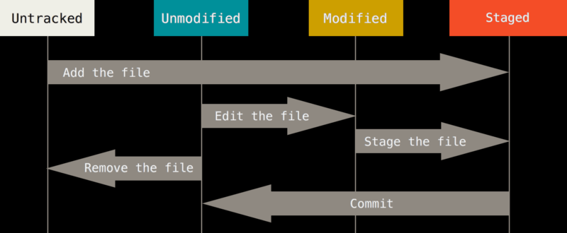
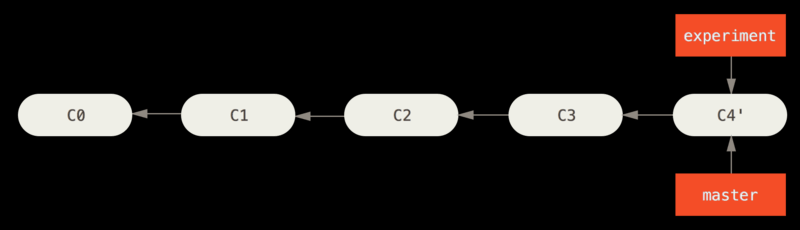

[toc]
# git学习 
## git基础  

### git是什么
git是分布式版本控制系统。版本控制是一种记录一个或若干文件内容变化，以便将来查阅特定版本修改情况的系统。有了它你就可以将某个文件回溯到之前的状态。甚至将整个项目回退到某个时间点的状态。   
分布式管理系统的客户端不只提取最新版本的文件快照，而是把代码仓库完整地镜像下来，其每一次的克隆操作，实际上都是一次对代码仓库的完整备份。  

### 直接记录快照，而非差异比较
Git和其他版本控制系统的主要差别在于Git对待数据的方法上。大部分版本控制系统以文件变更列表的方式存储信息，这类系统将它们保存的信息看作是一组基于文本和每个文件随时间逐步累积的差异。  
  
而git不按照以上方式对待或保存数据。反之，git更像是把数据看作是对小型文件系统的一组快照。每次你提交更新，或在git中保存项目状态时，它主要对当时的全部文件制作一个快照并保存这个快照的索引。  
  

### 近乎所有的操作都在本地执行
Git在本地保存了完整的代码仓库镜像。其绝大多数操作都只需要访问本地文件和资源。这意味着你在离线环境(如飞机、火车上)也可以进行任何操作，而不依赖于中央服务器。

### Git一般只添加数据
你执行的Git操作，几乎只往Git数据库中增加数据，很难让Git执行任何不可逆操作，或者让它以任何方式清除数据。这使得我们使用git成为一个安心愉悦的过程，因为我们可以尽情做各种尝试，而没有把事情弄糟的危险。

### Git的两个概念
#### git三个工作区域

Git仓库目录：是Git用于保存项目的元数据和对象数据库的地方，这是Git中最重要的部分，从其他计算机克隆仓库时，拷贝的就是这里的数据。(对应在本地系统就是.git目录，复制该目录实际上就是拷贝了整个仓库，可以仅仅复制该目录来分发仓库。)  
工作目录：是对项目的某个版本独立提取出来的内容，这些从git仓库的压缩数据中提取出来的文件，放在磁盘中供你使用或修改  
暂存区：是一个位于.git目录中的一个文件，保存了下次将提交的文件列表信息。有时候也被称作索引。  
根据这三个目录来确定git基本的工作流程：  
1. 在工作目录中修改文件
2. 暂存文件，将文件的快照放入暂存区域
3. 提交更新，找到暂存区的文件，将快照永久性存储在Git仓库目录中

#### git文件的三个状态
已提交(committed):表示数据已经安全地保存在本地数据库中  
已修改(modified):表示修改了文件，但是还没有保存在数据库中  
已暂存(staged):表示对一个已修改文件的当前版本做了标记，使之包含在下次提交的快照中  

## git起步

### 初次运行前的配置
Git自带一个git config的工具来帮助我们设置控制Git外观和行为的配置变量。这些变量存储在三个不同的位置：
1. /ect/gitconfig文件：包含系统上每一个用户及他们仓库的通用配置。如果使用带有--system选项的git config时，它会从此文件读取配置变量。
2. ~/.gitconfig或~/.config/git/config文件：只针对当前用户，可以传递--global选项让Git读写此文件
3. 当前使用仓库的Git目录下的config文件(.git/config)：针对于该仓库，不加选项可以读取该文件  
每一个级别会覆盖上一个级别的配置。

#### 配置用户信息
我们使用git第一件要做的事情就是自报家门，设置用户名称与邮件地址。  
``` bash
git config --global user.name "hncjygd"
git config --global user.email "499893911@qq.com"
```
可以使用 git config --list来列出所有git当时可以找到的配置。 
``` bash 
git config --list
core.symlinks=false
color.branch=auto
http.sslbackend=openssl
user.name=hncjygd
user.email=499893911@qq.com
core.repositoryformatversion=0
core.filemode=false
...
``` 

### 获取Git仓库

#### 在现有目录中初始化仓库
如果打算使用git对当前目录进行管理，输入：
``` bash
git init 
Initialized empty Git repository in E:/studygit/.git/
```
如果需要创建一个新的目录作为初始化仓库，输入：
``` bash
git init dirname
```  
通过git init命令将创建一个.git的子目录，这个子目录含有你初始化的Git仓库中所有的必须文件，这些文件是Git仓库的骨干。  

#### 克隆现有的仓库
如果你想要获得一份已经存在的Git仓库的拷贝。最简单的方法就是负责该仓库的.git目录到本地目录。但是如果这个仓库位于远程服务器上，需要使用git clone命令了。  
``` bash
git clone https://github.com/libgit2/libgit2
```  
这会在当前目录下创建一个名为libgit2的目录，并在这个目录下初始化一个.git文件夹，从远程仓库拉取下所有数据放入.git文件夹，然后从中读取最新版本的文件拷贝到工作区目录。

### 记录每次更新到仓库
工作目录下的每一个文件都不外乎有两种状态:已跟踪或未跟踪。已跟踪的文件是指那些被纳入了版本控制的文件，在上一次快照中有它们的记录，在工作一段时间后，他们的状态可能处于未修改，已修改或已暂存。工作目录中除了已跟踪文件外的所有其他文件都是未跟踪文件。他们既不存在于上次快照中，也没有放入暂存区。  
编辑过某些文件之后，由于自上一次提交后你对他们做了修改，git将它们标记为已修改文件。我们逐步将这些修改过的文件放入暂存区，然后提交所有暂存区的修改，如此反复，使用Git时文件的生命周期如下：  


#### 检查当前文件状态 git status
四种状态：Untracked - 未跟踪    Unmodified - 未修改     Modified - 已修改   Staged - 已暂存  
初始化仓库时查看状态：  
``` bash
git status
On branch master
nothing to commit, working tree clean
```  
状态说明现在的工作目录相当干净，即所有已跟踪文件在上次提交后都未被更改过。此外，上面的信息还表明，当前目录下没有出现任何未跟踪状态的新文件。    
我们创建一个新的README文件，然后执行git status命令：
``` bash
git status
On branch master

No commits yet

Untracked files:
  (use "git add <file>..." to include in what will be committed)

        readme.md

nothing added to commit but untracked files present (use "git add" to track)
```
在状态报告中可以看到新建的README文件出现在Untracked files下面表示未跟踪的文件。这意味着Git在之前的快照中没有这些文件。  

#### 跟踪新文件 git add
使用git add开始跟踪一个文件，然后查询文件状态：
``` bash
git add readme.md
git status
On branch master

Changes to be committed:
  (use "git rm --cached <file>..." to unstage)

        new file:   readme.md
```
上面说明该文件已经被暂存，但还没有提交。

#### 提交以跟踪文件 git commit
现在的暂存区已经准备妥当可以提交了，通常我们会添加-m参数在提交的同时创建提交信息：  
``` bash
git commit -m "1 commit"
[master (root-commit) a0874ec] 1 commit
 1 file changed, 0 insertions(+), 0 deletions(-)
 create mode 100644 readme.md
 ```
 提示后告诉你，当前在master分支上提交，本次提交的commit id是a0874ec,以及本次提交的提交信息是"1 commit"。还告诉你了本次提交有多少个文件修订过，添加了多少行，删除了多少行。  
 重点：**提交时记录的是放在暂存区域的快照，任何还未暂存的仍然保持已修改状态，可以在下次提交时纳入版本管理，每一次运行提交操作，都是对你项目做一次快照，以后可以回到这个状态，或者进行比较。**

 #### 工作区修改文件
 现在我们修改readme.md文件，然后通过git status来查看文件状态：
 ``` bash
git status
On branch master
Changes not staged for commit:
  (use "git add <file>..." to update what will be committed)
  (use "git checkout -- <file>..." to discard changes in working directory)

        modified:   readme.md

no changes added to commit (use "git add" and/or "git commit -a")
 ```
 提示改变还没有暂存，其中有两个操作：
 - 如果要提交更改，就执行git add来加入暂存区，然后随commit提交
 - 如果要放弃修改，就执行~~git checkout -- file~~(该命令在新的git中已经被抛弃，git checkout以后专门用于版本库的操作现在使用git restore file来放弃更改,以前的命令依然是可用的)来放弃修改

 我们还看到，此时readme.md被标记为modified即已修改。

 #### 暂存区操作
 我们来将修改后的readme.md添加到暂存区，并查看状态：
 ``` bash
 git add readme.md
 git status
 On branch master
Changes to be committed:
  (use "git reset HEAD <file>..." to unstage)

        modified:   readme.md
```
可以看到，改变可以被提交，这里也可以有两种操作：
- git commit 将暂存区的修改提交到版本库中
- ~~git reset HEAD <file>~~（现在使用git restore --staged file来取消暂存） 取消暂存并将工作区的文件返回到commit id指定的版本，返回到HEAD时的状态(HEAD指版本库最近的一次提交，也可以用commid id来返回到任意一次提交)  
假设此时你再次修改readme.md文件，通过git status来查看状态：
``` bash
git status
On branch master
Changes to be committed:
  (use "git reset HEAD <file>..." to unstage)

        modified:   readme.md

Changes not staged for commit:
  (use "git add <file>..." to update what will be committed)
  (use "git checkout -- <file>..." to discard changes in working directory)

        modified:   readme.md
```
根据提示可以看到，readme.md文件同时出现在暂存区和非暂存区。实际上任何已经暂存的文件已经被纳入了版本管理系统。(如何理解这就话：对于一个新建文件，如果你编辑后没有add到暂存区，然后删除了该文件是无法通过git恢复的，因为这个文件是在未跟踪状态下删除的。但是如果已经add到暂存区，然后我们在删除这个新文件，是可以通过git checkout -- <newfile>来恢复文件的。可见只要进入暂存区就被纳入了版本管理了)  
这个时候也有两种操作：
- git add readme.md 这会使用新的修改来覆盖暂存区中的版本
- git checkout -- readme.md 这会放弃这次修改(并不会删除上一次对readme的暂存)  

最终我们使用 git commit -m "2 commit" 来真正的提交他们

#### 查看修改
我们通过git status可以查看哪些文件做了修改，但是不知道具体修改了什么地方。这就需要使用git diff命令来查看修改的具体内容。通过git diff可以看出文件的具体修改内容，他又三种方式：
- git diff 查看工作区与暂存区中的区别
- git diff --cached 查看暂存区与版本库中的区别
- git diff HEAD 查看工作区与指定版本库的区别

#### 移除文件
移除文件分两种情况：
- 未跟踪文件：直接使用rm <file>来移除即可，但是这并不能被git还原。因为该文件还没有纳入版本管理系统。
- 已跟踪文件：
  1. 第一步：直接通过 rm <file>命令删除，并查看：
  ``` bash
  rm readme.md
  git status
  On branch master
  Changes not staged for commit:
  (use "git add/rm <file>..." to update what will be committed)
  (use "git checkout -- <file>..." to discard changes in working directory)

        deleted:    readme.md

  no changes added to commit (use "git add" and/or "git commit -a")
  ```
  通过提示，可以看到，与已更改文件类似，也是需要通过git add/rm将删除暂存，或者使用git checkout -- <file>来放弃删除。
  2. 第二步：删除或者恢复：
    - 根据提示通过git add/rm来将删除动作暂存
    - 根据提示通过git checkout -- 来撤销删除动作
  3. 实际上通过 git rm <file>命令来合并操作，即运行 rm <file> 然后执行 git add <file>
- 还有一种情况：如果我们想要把文件从Git仓库中删除(即从暂存区或者版本库中删除),但仍然希望保留在当前工作区中。换句话说，你想让文件保留在磁盘中，但不想让Git继续跟踪。当你忘记添加.gitignore文件而一不小心把一些日志文件添加到暂存区时，这一做法尤其有用。通过 git rm --cached <file>来实现：
``` bash
git rm --cached readme.md
git status
On branch master
Changes to be committed:
  (use "git reset HEAD <file>..." to unstage)

        deleted:    readme.md

Untracked files:
  (use "git add <file>..." to include in what will be committed)

        readme.md
```

#### 移动文件
Git并不显式跟踪文件移动操作。如果在Git中重命名了某个文件，仓库中存储的元数据并不会体现出这是一次改名操作，不过Git会推断出究竟发生了什么。对于mv操作：
> git mv readme.md README   

它会恰如预期般正常工作，实际上可以git status来查看：
``` bash
git mv readme.md README
git status
On branch master
Changes to be committed:
  (use "git reset HEAD <file>..." to unstage)

        renamed:    readme.md -> README
```
但是，其实，运行git mv就相当于运行了下面三条命令:
``` bash
mv readme.md README
git rm readme.md
git add README
```
如果你分成这三条语句操作，Git也会意识到这是一次改名。所以不管何种方式结果都是一样的。唯一的区别是，git mv是一条命令，而mv则需要三条命令配合。只是如果有时候用其他工具批处理改名的时候，需要记得在提交前删除来的文件名，再添加新的文件名。

#### 版本回退
如果你对一次提交不满意想要回退到上一次提交的状态。  
例如我删除了工作区的readme.md文件，并且将删除提交了上去，但是我此时后悔了，想要恢复这个文件到上上一次提交的状态。这个时候我们可以通过移动HEAD指针来实现恢复。
>使用 git reset --hard HEAD^  
git reset --hard用于回退版本，其后可以跟coomitid，每次commit命令会显示该id，如果没有记住我们也可以通过HEAD^表示上一个版本，HEAD^^表示上上一个版本，以此类推。如果这也没有记住，可以通过git log命令来查看版本历史，其中可以找到commitid。  
git版本回退的速度非常的快，这是因为git内部维护了一个指向当前版本的HEAD指针，当你退版本的时候，git仅仅是把HEAD指针指向了你要回退到的版本，然后顺便跟新了工作区而已。  
  
此时如果你又后悔了，想要恢复到删除了readme.md时的最新版本。但是我忘记了那一次commitid要咋办。执行git log命令也没有发现那一次的commitid。  
不要着急，在git中只要你提交了跟踪，总是有后悔药可以吃的。此时我们可以运行git reflog来记录每一次HEAD的变更。
```
git reflog  

91d472a HEAD@{3}: reset: moving to HEAD^
4b2380b HEAD@{5}: commit: delete git.md
aa998b5 (HEAD -> master) HEAD@{6}: commit: 3 commit
91d472a HEAD@{7}: commit: 2 commit
25c8c9e HEAD@{8}: commit (initial): 1 commit
```
可以看到删除的时候的commitid是4b2380b，然后我们执行 git reset --hard 4b2 就可以从新回到删除时的状态，commitid并不需要输入全，只需要git唯一可以找到它就好了。 

#### 查看提交历史
在提交了若干更新，有或者克隆了某个项目之后，如果想要回顾下提交历史，或者你需要知道以前提交的commit id。可以使用git log命令来实现。
``` bash
git log
commit af4639df9d568a8106f7a552c446dc65a8279ad6 (HEAD -> master)
Author: hncjygd <499893911@qq.com>
Date:   Mon May 21 21:03:40 2018 +0800

    3 commit

commit 1334ad8a6a1fd04f54d35f299473a4bece82634d
Author: hncjygd <499893911@qq.com>
Date:   Mon May 21 20:28:55 2018 +0800

    2 commit

commit a0874ec04e183bc183f4d845a7cd7d8f46dce1f8
Author: hncjygd <499893911@qq.com>
Date:   Mon May 21 17:18:29 2018 +0800

    1 commit
```
默认不用任何参数的情况下，git log会按提交时间列出所有的更新，最近的更新排在最上面。  
可以添加 -p 选项用来显示每次提交的内容差异。也可以加上 -2 等来仅仅显示最近两次提交。  
使用 --pretty==oneline 选项可以指定使用不同默认格式的方式展示提交历史。

#### 撤销操作
主要有三种情况需要撤销操作：
1. 如果你在提交完毕后才发现漏掉了几个文件没有添加，或者提交信息写错了。此时，可以运行带有--amend选项的提交命令来尝试重新提交。
``` bash
git commit --amend -m "three commit"
git log
commit 2615f6d9a117e3f8ce30dfc736f7fb694999f423 (HEAD -> master)
Author: hncjygd <499893911@qq.com>
Date:   Mon May 21 21:03:40 2018 +0800

    three commit

commit 1334ad8a6a1fd04f54d35f299473a4bece82634d
Author: hncjygd <499893911@qq.com>
Date:   Mon May 21 20:28:55 2018 +0800

    2 commit

commit a0874ec04e183bc183f4d845a7cd7d8f46dce1f8
Author: hncjygd <499893911@qq.com>
Date:   Mon May 21 17:18:29 2018 +0800

    1 commit
```
可以看到并没有生成新的提交，仅仅是将提交信息改变了。相当于覆盖了上一次提交的内容。  
当你在提交后发现忘记暂存某些需要的修改，可以像下面：
``` bash
git commit -m "message"
git add forgotten_file
git commit --amend
```
以上命令并不会生成两次提交，而是将第二次提交代替第一次提交的结果。

2. 取消暂存的文件
即从暂存区撤出该文件，根据提示使用 git reset HEAD <file>来取消暂存。  

3. 撤销对文件的修改
修改文件是在工作区中进行的，通过 git checkout -- <file>来撤销对之前所有的修改。
**总结：在Git中任何已提交的东西几乎总是可以恢复的，甚至那些被删除的分支中的提交或使用--amend选项覆盖的提交也可以恢复，然而，任何你未提交的东西丢失很可能就再也找不到了。**

#### 打标签
可以给历史中的某一个提交打上标签，以表示其重要。比较有代表性的是人们会使用这个功能来标记发布版本。  
##### 创建标签
Git使用两种主要类型的标签：轻量标签和附注标签  
1. 轻量标签的本质上是将提交校验和存储到一个文件中，没有保存其他任何信息。  
> git tag v1.0  

通过上述语句就创建了一个轻量标签。  
2. 附注标签：
> git tag -a v1.1 -m "my version 1.1"  

他指定了一条将会存储在标签中的信息。  
3. 后期打标签，通过git log查看以往提交的commit id，来为以前的提交打标签：
> git tag -a v1.2 9fceb02

##### 查看标签
1. git tag - 直接列出所有的标签(以字母顺序排序)
2. git show - 可以看到标签信息与对应的提交信息

##### 共享标签
默认情况下，git push命令不会传送标签到远程仓库服务器上。在创建完标签后必须显式地推送标签到远程服务器上。
> git push origin [tagname]

## git分支

### 分支简介
为了理解Git处理分支的方式，来回顾一下Git是如何保存数据的。  
git保存的不是文件的变化或者差异，而是一系列不同时刻的文件快照。在进行提交操作时，Git会保存一个提交对象。该提交对象中包含一个指向暂存内容快照的指针。但不仅仅是这样，该提交对象还包含了作者的姓名和邮箱、提交时输入的信息以及指向它的父对象的指针(首次提交产生的提交对象没有父对象，普通提交操作产生的提交对象有一个父对象，而由多个分支合并产生的提交对象有多个父对象)。  
Git的分支，其实本质上仅仅是指向提交对象的可变指针。Git的默认分支名字是master，它会在每次提交操作中自动向前移动。  
  

#### 分支创建
> git branch testing  

执行上面的命令会在当前的提交对象上创建一个新指针。  
  
此时，实际上我们还是在master指针上工作。Git中维护了一个名为HEAD的特殊指针，指向当前所在的本地分支(可以理解为当前分支的别名)。  
  
通过 git branch命令可以查看当前所有分支：  
``` bash
git branch 
* master
  testing
```
其中前面有*的表示当前工作分支，也就是HEAD指向的分支。  

#### 分支切换
要切换到一个已经存在的分支，可以使用git checkout命令：  
> git checkout testing


实际上切换分支就是将HEAD指针指向testing分支。  
此时我们可以修改工作区的内容并提交：
``` bash
vim README
git commit -a -m "change"
```


此时我们在进行切换操作：  
> git checkout master
  

**注意：分支切换会改变工作目录的文件，如果切换到一个旧的分支，你的工作目录会恢复到分支最后一次提交时的样子。**  
此时我们再次修改文件:  
``` bash 
vim README
git commit -a -m "other change"
```
   
``` bash
git log --oneline --decorate --graph --all
* 36497f9 (HEAD -> master) other change
| * e6d1b1c (testing) change
|/
* 2615f6d three commit
* 1334ad8 2 commit
* a0874ec 1 commit
```
这两次改动针对的是不同的分支，你可以在不同分支之间不断地来回切换和工作，等待时机成熟时还可以将他们合并起来。  
由于Git的分支实质上仅包含所指对象校验和(即commit id一个长度为40的SHA-1值字符串)的文件，所以它的创建和销毁都异常有效。就是创建了一个包含该commit id的指针而已。  

###分支合并
首先我们来简单总结下git中的工作流：  
1. 对于开发一个网站的项目，先创建一个仓库
2. 实现该网站的基本功能
3. 为实现一个新的需求，创建一个分支
4. 在这个分支上开展工作  
5. 此时主分支上出现了一个严重问题需要修补：
  - 切换到主分支
  - 为这个紧急任务创建一个新分支，并在其中修复他们
  - 测试通过后，切换到主分支，然后合并这个修补分支到主分支
6. 完成上述修复工作后，切换到开发分支，继续工作  

``` bash
git branch iss53                  #创建iss53分支作为新功能开发分支
git checkout iss53                #切换分支进行开发
vim index.html                    #修改内容
git commit -a -m "change index"   #推送修改
```
此时的分支历史为：  


此时主分支master上出现严重bug需要修复。  

``` bash
git checkout master         #切换到主分支
git checkout -b hotfix      #创建并切换到hotfix分支
vim index.html              #修复bug
git commit -a -m "fix bug"  #推送修改
```
此时的分支历史为:  
  

此时可以在该分支上运行你的测试，确保你的修改时正确的。等到测试完毕后将其合并会你的master分支来部署到线上。分支合并使用 git merge 命令：
``` bash
git checkout master         #切换到需要合并到的分支
git merge hotfix            #将hotfix合并到master分支上
```
此时的分支历史为：
  
注意这次合并为fast-forward即快速合并。由于当前master分支所指向的提交是你当前提交的直接上游，所以git只是简单的将指针向前移动。换句话说，当你试图合并两个分支的时候，如果顺着一个分支走下去能够到达另一个分支，那么git在合并两者的时候，只是简单的讲指针向前推进，因为这种情况下合并操作没有需要解决的问题。  

此后我们可以删除这个修复分支，并切换到iss53开发分支上继续工作:
``` bash
git branch -d hotfix          #删除修复分支
git checkout iss53            #切换到开发分支上继续工作
vim index.html                #修改内容
git commit -a -m "finished"   #推送修改
```
  

完成新功能开发后，需要将iss53分支合并到master上。这就与之前的hotfix分支的时候看起来有些不一样。在这种情况下，你的开发历史从一个更早的地方开始分叉开来。因为master分支所在提交并不是iss53分支所在提交的直接祖先，git不得不做一些额外的工作。出现这种情况的时候，git会使用两个分支的末端所指的快照(C4和C5)以及这两个分支的工作祖先(C2)，做一个简单的三方合并。   
  

并且git将此次三方合并的结果做了一个新的快照并且自动创建一个新的提交指向它。这个被称为一次合并提交，它的特别之处在于他又不止一个父提交。  
  

**遇到冲突时的分支合并:**  
有些时候合并操作并不会一帆风顺。如果你在两个不同的分支中，对同一个文件的同一个部分进行了不同的修改，git就没有办法干净的合并他们。此时如果你执行git merge操作后，git并没有自动创建一个新的合并提交，而是暂停下来等待你去解决合并产生的冲突。你可以在合并冲突后的任意时刻使用git status命令来查看那些因包含合并冲突而处于未合并状态下的文件(被标记为unmerged状态)。此时你需要做的就是修改这些冲突文件。  
等待你修改完成后，输入git commit来完成合并提交即可。

### 分支管理
通过使用git branch添加参数的方式来进行分支管理：  
``` bash
git branch    #查看当前所有分支，在当前工作分支前有一个*标识
  iss53
* master
  testing

git branch -v #查看当前所有分支的最后一次提交
  iss53   93b412c fix javascript issue
* master  7a98805 Merge branch 'iss53'
  testing 782fd34 add scott to the author list in the readmes

git branch --merged   #过滤当前已经合并到当前分支的分支
  iss53
* master

git branch --no-merged  #过滤当前未合并到当前分支的分支
  testing

git branch -d testing   #删除当前分支，可能导致失败，因为未合并删除会导致丢掉这些工作此时需要用-D
```

### 变基
在git中整合不同分支的修改主要有两种方法:merge合并和rebase变基。  
开发过程中难免会出现开发任务分叉到两个不同分支并各自提交了更新:
  
如果使用之前介绍的merge命令来将两个分支的最新快照以及二者最近的祖先进行三方合并，合并的结果生成一个新的快照提交：  
  

其实，还有一种方法：可以提取在C4中引入的补丁和修改，然后再C3的基础上应用一次，在git中，这种操作就叫做变基。通过使用rebase命令来实现。
``` bash
git checkout experiment
git rebase master
```
它的原理是首先找到这两个分支(即当前分支experiment、变基操作的目标基底分支master)的最近共同祖先C2，然后对比当前分支相对于该祖先的历次提交，提取相应的修改并存为临时文件，然后将当前分支指向目标基底C3，最后以此将之前另存为临时文件的修改依序应用。
  
然后回到master上进行一次快速合并：  
  

merge和rebase这两种整合方法的最终结果没有任何区别，但是变基使得提交历史更加整洁。可以看到一个经过变基操作的分支历史是一条直线没有分叉。  
一般情况下，我们这么做的目的是为了确保在向远程分支推送时能保持提交历史的整洁。  
**变基的风险：**
*不要对在你的仓库外有副本的分支执行变基*  
变基操作的实质是丢弃一些现有的提交，然后相应地新建一些内容一样但实际上不同的提交。如果你已经将提交推送至某个仓库，而其他人也已经从该仓库拉取提交并进行了后续工作，此时，如果你用git rebase命令重新整理了提交并再次推送，你的同伴因此将不得不再次将他们手头的工作与你的提交进行整合，如果接下来你还要拉取并整合他们修改过的提交，事情就会变得一团糟。

## git工具

### 储藏和清理
当你为项目创建一个新的功能的时候，master分支出现了bug需要修复，而这时你想要切换到master分支做一些别的事情，问题是，你不想仅仅因为过会儿回到这一点而为做了一半的工作创建一次提交。针对这个问题的解决方案是使用git stash命令来储藏现场。
```bash
git stash   #储藏现场
Saved working directory and index state \
  "WIP on master: 049d078 added the index file"
HEAD is now at 049d078 added the index file
(To restore them type "git stash apply")

git status  #储藏完现场后查看工作区是干净的了
# On branch master
nothing to commit, working directory clean

git stash list  #查看储藏区，假设我们前面还进行了两次储藏
stash@{0}: WIP on master: 049d078 added the index file
stash@{1}: WIP on master: c264051 Revert "added file_size"
stash@{2}: WIP on master: 21d80a5 added number to log

git stash apply #应用最近的储藏，干净的工作区重新被应用
On branch master
Changed but not updated:
   (use "git add <file>..." to update what will be committed)

      modified:   index.html
      modified:   lib/simplegit.rb

git stash apply stash@{1}   #通过指定名字来应用其他储藏

git stash drop stash@{0}    #通过添加名字来移除储藏
```

## git远程仓库

### 远程仓库简介
我们通过码云(gitee)和github来管理我们的代码。 
第一步： 创建SSH Key:
> ssh-keygen -t rsa -C "499893911@qq.com"

此时会在你用户主目录下，看到一个.ssh目录，并且其中有id_rsa和id_rsa.pub两个文件。其中id_rsa是私钥不能泄露。而id_rsa.pub是公钥，可以放心给其他人。  

第二步：登陆到gitee，在设置中添加公钥
  

第三步：新建项目，项目名最好与你本地仓库的目录名相同  
  

第四步：关联本地库与远程仓库或克隆远程仓库  
> git clone git@gitee.com:hncjygd/mystudy.git   #克隆仓库，用在先有远程库而后有本地库的情况

> git remote add origin git@gitee.com:hncjygd/mystudy.git #关联远程库，用在先有本地库而后有远程库的情况

第五步：拉取/推送本地内容
> git pull #抓取所有的远程应用，然后将远程master分支合并到本地master分支上

> git push origin master #将本地master分支推送到远程origin仓库中

### 远程仓库的使用

#### 创建远程仓库
1. 通过克隆操作创建
> git clone git@gitee.com:hncjygd/mystudy.git  

这个命令会将当前目录初始化为一个git版本库。并在这个目录下初始化一个.git文件夹，从远程仓库拉取下所有数据放到.git文件夹，然后从中读取最新的文件的拷贝。 

2. 关联远程仓库
> git remote add <shortname> <url> #添加一个新的远程git仓库

``` bash
git remote add github git@github.com:hncjygd/mystudy.git
git remote add origin git@gitee.com:hncjygd/mystudy.git
```
可以关联多个远程仓库。注意他们的shortname名字不能相同，约定俗称远程仓库名通常为origin。  
**注意：origin是远程仓库名，而不是远程分支名，其远程主分支为origin/master**

#### 查看远程仓库
通过使用git remote命令来查看远程仓库。可以指定-v会显示需要读写远程仓库使用的git保存的简写与其对应的URL  
``` bash
git remote -v
origin  git@gitee.com:hncjygd/mystudy.git (fetch)
origin  git@gitee.com:hncjygd/mystudy.git (push)
```
#### 从远程仓库中抓取与拉取

>git fetch [remote-name]  #这个命令会访问远程仓库，从中拉取所有你没有的数据  

必须注意git fetch命令会将数据拉取到你的本地仓库(即.git目录中)，他并不会自动合并或修改你当前的工作，但准备好时你必须手动将其合并入你的工作。

#### 推送到远程仓库
当你想分享你的项目的时候，必须将其推送到远程仓库，通过git push [remote-name] [branch-name]  
> git push origin master  
只有当你有所克隆服务器的写入权限，并且之前没有人推送时，这条命令才能生效。当你和其他人在同一时间克隆，他们先推送到上游然后你再推送，你的推送肯定会报错，此时你必须先将他们的推送拉取下来并且将其合并到你的工作中去才能推送。

#### 远程仓库的移除和重命名
如果你想要重命名引用的名字可以使用 git remote rename去修改一个远程仓库的简写名(默认为origin).主要用于绑定多个远程仓库的名字冲突问题。  
通过git remote rm可以删除与远程仓库的绑定。

### 远程分支
远程引用是对远程仓库的引用，包括分支、标签等。可以通过git ls-remote 来显示地获取远程引用的完整列表。或者通过git remote show 获得远程分支的更多信息。最常见的做法是利用远程跟踪分支。  
远程跟踪分支是远程分支状态的引用，他们是你不能移动的本地引用，当你做任何网路通信操作时，他们会自动移动。远程跟踪分支像你上次连接到远程仓库时，那些分支所处的状态的标签。  
他们以remote/branch形式命名，例如，如果你想要看你最后一次与远程仓库origin通信时master分支的状态，你可以查看origin/master分支。你与同事合作解决一个问题并且他们推送了一个iss53分支，你可能有自己的iss53分支，但是在服务器上的分支会指向origin/iss53的提交。  
举例：  
假设有一个git.ourcompany.com的Git服务器，如果你从这里克隆，git的clone命令会为你自动将其命名为origin，拉取它的所有数据，创建一个指向它的master分支的指针，并且在本地将其命名为origin/master。git也会给你一个与origin的master分支在指向同一个地方的本地master分支，这就是你工作的基础。
  

如果你在本地的master分支上做了一些工作，然后再同一时间，其他人推送提交到git.ourcompany.com并更新了它的master分支，那么你的提交历史将向不同的方向前进。
  

如果要同步你的工作，首先要运行git fetch origin命令，这个命令查找origin是哪一个服务器，从中抓取本地没有的数据，并且更新本地数据库，移动origin/master指针指向新的、更新后的位置：  


当你想要公开分享一个分支时，需要将其推送到有写入权限的远程仓库上，本地的分支并不会自动与远程仓库同步，你必须显式地推送想要分享的分支。这样你就可以把不愿意分享的内容放到私人分支上，而将需要和别人协作的内容推送到公开分支上。  
假设希望和别人一起在名为serverfix的分支上工作，可以向推送第一个分支那样推送它。  
``` 
git push origin serverfix
Counting objects: 24, done.
Delta compression using up to 8 threads.
Compressing objects: 100% (15/15), done.
Writing objects: 100% (24/24), 1.91 KiB | 0 bytes/s, done.
Total 24 (delta 2), reused 0 (delta 0)
To https://github.com/schacon/simplegit
 * [new branch]      serverfix -> serverfix
```
这样，下一次其他协作者从服务器上拉取数据的时候，他们会在本地生成一个远程分支origin/serverfix，指向服务器的serverfix分支的引用：  
``` bash
git fetch origin
remote: Counting objects: 7, done.
remote: Compressing objects: 100% (2/2), done.
remote: Total 3 (delta 0), reused 3 (delta 0)
Unpacking objects: 100% (3/3), done.
From https://github.com/schacon/simplegit
 * [new branch]      serverfix    -> origin/serverfix
```
要要特别注意的一点是当抓取到新的远程跟踪分支时，本地不会自动生成一份可编辑的副本（拷贝）。 换一句话说，这种情况下，不会有一个新的 serverfix 分支 - 只有一个不可以修改的 origin/serverfix 指针。  
可以运行 git merge origin/serverfix 将这些工作合并到当前所在的分支。 如果想要在自己的 serverfix 分支上工作，可以将其建立在远程跟踪分支之上：
``` bash
git checkout -b serverfix origin/serverfix
Branch serverfix set up to track remote branch serverfix from origin.
Switched to a new branch 'serverfix'
```
这会给你一个用于工作的本地分支，并且起点位于origin/serverfix.

#### 跟踪分支
从一个远程跟踪分支检出一个本地分支会自动创建一个叫做 “跟踪分支”（有时候也叫做 “上游分支”）。 跟踪分支是与远程分支有直接关系的本地分支。 如果在一个跟踪分支上输入 git pull，Git 能自动地识别去哪个服务器上抓取、合并到哪个分支。  
当克隆一个仓库时，它通常会自动地创建一个跟踪 origin/master 的 master 分支。 然而，如果你愿意的话可以设置其他的跟踪分支 - 其他远程仓库上的跟踪分支，或者不跟踪 master 分支。 最简单的就是之前看到的例子，运行 git checkout -b [branch] [remotename]/[branch]。 这是一个十分常用的操作所以 Git 提供了 --track 快捷方式：
``` bash
git checkout --track origin/serverfix
Branch serverfix set up to track remote branch serverfix from origin.
Switched to a new branch 'serverfix'
```
如果想要将本地分支与远程分支设置为不同名字，你可以轻松地增加一个不同名字的本地分支的上一个命令：
``` bash
git checkout -b sf origin/serverfix
Branch sf set up to track remote branch serverfix from origin.
Switched to a new branch 'sf'
```
现在，本地分支 sf 会自动从 origin/serverfix 拉取。

设置已有的本地分支跟踪一个刚刚拉取下来的远程分支，或者想要修改正在跟踪的上游分支，你可以在任意时间使用 -u 或 --set-upstream-to 选项运行 git branch 来显式地设置。
``` bash
git branch -u origin/serverfix
Branch serverfix set up to track remote branch serverfix from origin.
```
如果想要查看设置的所有跟踪分支，可以使用 git branch 的 -vv 选项。 这会将所有的本地分支列出来并且包含更多的信息，如每一个分支正在跟踪哪个远程分支与本地分支是否是领先、落后或是都有。
``` bash
git branch -vv
  iss53     7e424c3 [origin/iss53: ahead 2] forgot the brackets
  master    1ae2a45 [origin/master] deploying index fix
* serverfix f8674d9 [teamone/server-fix-good: ahead 3, behind 1] this should do it
  testing   5ea463a trying something new
```
这里可以看到 iss53 分支正在跟踪 origin/iss53 并且 “ahead” 是 2，意味着本地有两个提交还没有推送到服务器上。 也能看到 master 分支正在跟踪 origin/master 分支并且是最新的。 接下来可以看到 serverfix 分支正在跟踪 teamone 服务器上的 server-fix-good 分支并且领先 3 落后 1，意味着服务器上有一次提交还没有合并入同时本地有三次提交还没有推送。 最后看到 testing 分支并没有跟踪任何远程分支。

需要重点注意的一点是这些数字的值来自于你从每个服务器上最后一次抓取的数据。 这个命令并没有连接服务器，它只会告诉你关于本地缓存的服务器数据。 如果想要统计最新的领先与落后数字，需要在运行此命令前抓取所有的远程仓库。 可以像这样做：$ git fetch --all; git branch -vv

**注意：**  
当 git fetch 命令从服务器上抓取本地没有的数据时，它并不会修改工作目录中的内容。 它只会获取数据然后让你自己合并。 然而，有一个命令叫作 git pull 在大多数情况下它的含义是一个 git fetch 紧接着一个 git merge 命令。 如果有一个像之前章节中演示的设置好的跟踪分支，不管它是显式地设置还是通过 clone 或 checkout 命令为你创建的，git pull 都会查找当前分支所跟踪的服务器与分支，从服务器上抓取数据然后尝试合并入那个远程分支。

由于 git pull 的魔法经常令人困惑所以通常单独显式地使用 fetch 与 merge 命令会更好一些。

#### 删除远程分支
假设你已经通过远程分支做完所有的工作了 - 也就是说你和你的协作者已经完成了一个特性并且将其合并到了远程仓库的 master 分支（或任何其他稳定代码分支）。 可以运行带有 --delete 选项的 git push 命令来删除一个远程分支。 如果想要从服务器上删除 serverfix 分支，运行下面的命令：
``` bash
git push origin --delete serverfix
To https://github.com/schacon/simplegit
 - [deleted]         serverfix
```
基本上这个命令做的只是从服务器上移除这个指针。 Git 服务器通常会保留数据一段时间直到垃圾回收运行，所以如果不小心删除掉了，通常是很容易恢复的。


