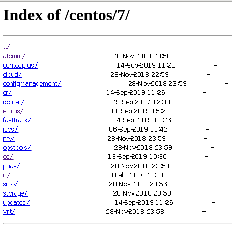

# 软件安装

## 安装源码包

在lunux下面源码包的安装是最常用的方式。而其他多数都是对源码包的封装。安装一个源码包就是需要我们把源代码编译成二进制的可执行文件。而linux中多数程序是使用c语言编写的，而编译器就是gcc。通常情况下安装一个源码包分为三个步骤：  

1. ./configure 在这一步可以定制功能，加上相应的选项即可。具体有什么选项可以通过 ./configure --help来查看。在这一步会自动检测你的linux系统与相关的套件是否有编译该源码包时需要的库，因为一旦缺少某个库就不能完成编译。只有检测通过后会生成一个Makefile文件。  
2. make 使用这个命令会根据Makefile文件中预设的参数进行编译，这一步其实就是gcc在工作了。gcc将源码编译成目标文件，这些目标文件通过函数库连接产生一个完整的可执行文件。此时这个可执行文件还没有被安装到预定安装的目录，仍然在当前的编译目录下  
3. make install 安装步骤，生产相关的软件存放目录和配置文件的过程。一般就是有etc lib bin man等目录分别代表配置文件、函数库、执行文件、线上说明文件  

需要注意的问题：  

1. 如果源码已经被编译过，其特点就是源码中包含一些*.o文件，此时我们可以执行 make clean 命令来去除目标文件，以保证新编译出来的可执行文件是在自己机器上编译完成的。  
2. makefile实际上就是一个文件，其有自己特有的语法，规定了那些文件需要先编译，哪些需要后编译等等，其就向一个shell脚本一样。  
3. ./configure 实际上就是为了生成一个makefile文件，其包含一些基本的参数
    1. --prefix=PREFIX 指定默认的安装路径，默认值为/usr/local
    2. --bindir=DIR 指定可执行程序安装路径，默认为PREFIX/bin
    3. --libcdir=DIR 指定库文件安装路径，默认PREFIX/lib
    4. --sysconfdir=DIR 指定配置文件安装路径，默认PREFIX/etc
    5. --mandir=DIR 指定斑竹文件安装路径，默认PREFIX/man
4. 源码包通常是一个.tar.gz文件，而linux建议将所有下载的源码包放到/usr/src/目录下，这并不是必须的，只是一个约定。方便以后的管理。
5. 其实在日常的源码安装工作中，并不是每个都是这样的，例如mysql使用cmake来建立makefile文件(即不需要执行./configure)，还有些是一个.sh文件来执行安装等等，具体还是需要建议事先阅读下源码安装包目录下的README或INSTALL等相关文件。并且在实际安装过程中，还是会出现报错的情况，通常都是因为缺少某一个库文件导致的，这个时候可以自己琢磨报错信息，或者百度一下。  

## 利用软件管理工具rpm和dpkg

由于源码包安装存在诸多问题，linux引入了软件管理机制进行软件包的安装、更新和卸载。其中最通用的两个软件管理工具就是rpm和dpkg。  

### rpm包

1. 全称： Red Hat Package Manager(Red Hat包管理器)
2. 文件名：一般遵循 软件名-版本-发布版本号.运行平台.rpm
    1. 运行平台：i386/i586/i686等是32位平台，x86_64是64位平台，noarch表示平台限制
3. 基本操作
    1. 安装 rpm -ivh 包名 
        1. -i 安装
        2. -v 可视化
        3. -h 显示安装进度
        4. --force 强制安装，即是覆盖属于其他包的文件也要安装
        5. --nodeps 当要安装的rpm包依赖其他包时，即是其他包没有安装，也要安装这个包
    2. 升级 rpm -Uvh 包名
    3. 卸载 rpm -e 包名 (这个包名并不是软件名，是通过rpm -q 查询得到的)
    4. 查询 rpm -q 包名
        1. rpm -q 包名 查询一个包是否安装，如果安装会获得包全名，在卸载时要用到
        2. rpm -qa 查询当前系统安转的所有包 rpm -qa | grep python 可以查询所有包名包含python的包
        3. rpm -qi 包名 得到一个rpm包的相关信息
        4. rpm -ql 包名 列出一个rpm包安装的文件(即这个软件都在什么地方放置了哪些内容)
        5. rpm -qf 文件的绝对路径 列出某一个文件属于那个rpm包

> 总结：  
> 最常用的就是：rpm -ivh 包名 来安装 以及 rpm -e 包名 来卸载  
> 查询命令一定要灵活使用，这样更加深入的理解linux
    
``` bash
[hncjygd@bogon ~]$ rpm -q python
python-2.7.5-86.el7.x86_64
[hncjygd@bogon ~]$ rpm -qi python
Name        : python
Version     : 2.7.5
Release     : 86.el7
Architecture: x86_64
Install Date: 2019年10月31日 星期四 18时58分18秒
Group       : Development/Languages
Size        : 80907
License     : Python
Signature   : RSA/SHA256, 2019年08月23日 星期五 05时40分03秒, Key ID 24c6a8a7f4a80eb5
Source RPM  : python-2.7.5-86.el7.src.rpm
Build Date  : 2019年08月07日 星期三 09时15分38秒
Build Host  : x86-01.bsys.centos.org
Relocations : (not relocatable)
Packager    : CentOS BuildSystem <http://bugs.centos.org>
Vendor      : CentOS
URL         : http://www.python.org/
Summary     : An interpreted, interactive, object-oriented programming language
Description :
Python is an interpreted, interactive, object-oriented programming
language often compared to Tcl, Perl, Scheme or Java. Python includes
modules, classes, exceptions, very high level dynamic data types and
dynamic typing. Python supports interfaces to many system calls and
libraries, as well as to various windowing systems (X11, Motif, Tk,
Mac and MFC).

Programmers can write new built-in modules for Python in C or C++.
Python can be used as an extension language for applications that need
a programmable interface.

Note that documentation for Python is provided in the python-docs
package.

This package provides the "python" executable; most of the actual
implementation is within the "python-libs" package.
[hncjygd@bogon ~]$ rpm -ql python
/usr/bin/pydoc
/usr/bin/python
/usr/bin/python2
/usr/bin/python2.7
/usr/libexec/platform-python
/usr/share/doc/python-2.7.5
/usr/share/doc/python-2.7.5/LICENSE
/usr/share/doc/python-2.7.5/README
/usr/share/man/man1/python.1.gz
/usr/share/man/man1/python2.1.gz
/usr/share/man/man1/python2.7.1.gz
[hncjygd@bogon ~]$ rpm -qf /etc/shadow
setup-2.8.71-10.el7.noarch
```

### dpkg包管理器

dpkg使用文本文件作为数据库来维护系统中软件，包括文件清单，依赖关系，软件状态等等。通常位于/var/lib/dpkg目录下。

1. 全称： Debin Package(Debian软件包管理器)
2. 文件名：与rpm包相同，后缀名为deb
3. 配置文件
    1. /etc/dpkg/dpkg.cfg dpkg的配置文件
    2. /var/log/dpkg.log dpkg的日志文件
    3. /var/lib/dpkg/available 存放系统所有安装过的软件包信息
    4. /var/lib/dpkg/status 存放系统所有安装软件软件的状态信息
    5. /var/lib/dpkg/info 记安装软件包控制目录的控制信息文件
4. 基本操作
    1. 安装 dpkg -i deb包
    2. 卸载 dpkg -r deb包(保留配置文件) dpkg -P deb包(清楚所有文件)
    3. 查询
        1. dpkg -l 包名 查询系统中软件包名符合的软件包
        2. dpkg -L 包名 查看包对应的软件包安装的文件及目录
        3. dpkg -s 包名 查看包对应的软件包信息

## 源码包与RPM包的区别

1. 安装位置的不同：  
    1. 对于RPM包来说：  
        1. /etc/ 配置文件安装目录
        2. /usr/bin/ 可执行文件目录
        3. /usr/lib/ 程序所使用的函数库保存位置
        4. /usr/share/doc/ 基本的软件使用手册保存位置
        5. /usr/share/man/ 帮助文件保存位置
    2. 对于源码安装，默认位置为/usr/local/
2. 安装位置不同带来的影响
    1. RPM包安装的服务可以使用系统服务管理命令(service)来管理
        1. 对于apache RPM安装可以使用 service httpd start 启动
    2. 对于源码需要使用绝对路径 /usr/local/apache2/bin/apachectl start
3. 管理方式的不同
    1. RPM删除软件可以直接 RPM -e 而源码不行
    2. 相应的源码删除软件直接将 /usr/local/软将名 这个目录直接删除了就好了
    3. 相对的如果使用PRM安装软件，由于依赖的关系，删除软件要小心，而源码就可以比较随意了

## 线上升级工具yum与apt

有了rpm和dpkg机制使安装软件软件变得更加简单，但是这些机制并没有完全解决软件属性依赖的问题。所以就出现了线上升级策略，这种策略就是系统先制定这些相依赖属性的软件列表，在安装某个软件包的时候，先到这个列表去找，同时与系统内已安装的软件相比较，这样没有安装的相依赖软件就能一次性全部安装起来了。  
yum是对rpm软件包管理器的功能上的扩展，因此yum是不能脱离rpm而独立运行的。

> yum运行说明：  
> 服务端中对程序包进行分类后存储在不同的repository容器中，再通过收集到大量的rpm的数据库文件中程序包之间的依赖关系数据，生成对应的依赖关系和所需文件在本地的存放位置的说明文件(位于容器的repldata目录下)  
> 客户端通过yum命令安装软件时发现缺少某个依赖程序包，客户会根据本地的配置文件/etc/yum.repos.d/*.repo找到指定的服务器，从服务器repository容器中获取说明文件后存放到本地/var/cache/yum中方便以后读取，通过该文件查找到需要安装的依赖包在服务器端存放的位置，在进入服务器端的指定位置获取程序包，下载完成后使用rpm安装。  
我们通过阿里云来掩饰这个过程：  

1. 登陆阿里云服务器找到centos7的镜像目录 [centos7镜像](https://mirrors.aliyun.com/centos/7/)  
2. 在其中可以看到 os extras updates等容器 
3. 在yum install 软件的时候，首先找到/etc/yum.repos.d/ 目录下的配置文件(文件名以.repo结尾，其实更换源就是更换该目录下的配置文件，例如更换为阿里云源就执行wget -O /etc/yum.repos.d/CentOS-Base.repo http://mirrors.aliyun.com/repo/Centos-7.repo 实际上就是下载一个.repo文件)。然后在其中找到对应的服务器中的容器。  
4. 例如找到了服务器端的extras容器 [extras容器](https://mirrors.aliyun.com/centos/7/extras/x86_64/)，在其下面有一个repodata文件夹，该文件夹中保存了软件依赖信息(一个xml文件和一些数据库文件)  
5. 将服务器端中repodata文件下载到/var/cache/yum/ 文件夹中  
6. 就可以根据存放在本地的repodata中的数据库文件来在服务器端找到对应的文件安装了。

yum使用手册：  

1. 安装：yum -y install 软件名  -y当遇到需要用户输入的时候，这个选项提供yes响应
2. 更新：yum update 软件名 当不接软件名的时候升级系统
3. 卸载：yum remove 软件名
4. 查询：
    1. yum search 软件名 查询相关软件
    2. yum list 列出目前yum管理的所有软件名称与版本 类似 rpm -qa
    3. yum provides 文件  从文件去搜索软件 类似 rpm -qf
5. 更新源：
    1. yum clean all 删除容器数据
    2. yum makecache 重建缓存文件