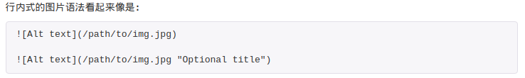

# 概述
Markdown是一个web上使用的文本到HTML的装换工具，可以通过简单易懂易写的文本格式生成结构化的HTML文档。
## 兼容HTML
Markdown不是想要取代HTML，其仅仅是用于构建一个文档，而且保证该文档容易读写和随意更改。  
不再Markdown涵盖范围内的标签，都可以直接在文档中使用HTML标签撰写。不需要额外标注这是HTML或者是Markdown，只要直接加标签就行了。   
举例说明：  
<p> this is a html tag </p>
<table>
    <tr>
        <td>name</td>
        <td>age</td>
        <td>address</td>
    <tr>
    <tr>
        <td>john</td>
        <td>12</td>
        <td>luoyang</td>
    <tr>
</table>
<p> this is an other html tag</p>

# 区块元素
## 段落和换行
一个Markdown段落由一个或多个连续的文本行组成的。它的前后有一个以上的空行。  
  
要想换行，在Markdown中仅仅回车是不行的，必须在回车前按下两个空格。当然也可以使用br标签来换行。  
Markdown中无论两段之间有多少个空行(只要这一行只有回车或者空格没有其他字符)再渲染之后，都只是隔着一行，要想隔着多行可以使用html换行标签来实现。

## 标题
Markdown支持使用#来插入标题，#的多少决定标题的级别 

    # 这是 H1
    ## 这是 H2
    ...
    ###### 这是 H6
</pre>

## 列表
Markdown支持有序列表和无序列表

### 无序列表
无序列表使用星号 加号 减号作为列表标记。通常我们使用-来标记，因为-不需要按下shift
- color
    - red
    - green
- food
    - chicken

无序列表可以缩进，通常使用tab来缩进。

### 有序列表
有序列表则使用数字接着一个英文句点来标记，有序列表也可以通过tab来缩进。
1. linux
    1. Ubuntu
    2. Deepin
2. windows
3. MacOS

### 代码区块
一些段落我们通常希望显示他们的原始码而不是翻译过后的，这个时候就要用到代码区块，则相当与在html中使用pre标签中的内容。  
要想在markdown中使用代码区块很简单就是缩进4个空格或者一个tab就可以了。  

    <p>这是一个代码区块，该区块中的内容不会被转译</p>
    ## 标题 在Markdown中用来表示一个标题
    - 无序列表 在Markdown中使用-来建立无序列表
    1. 有序列表 在Markdown中使用1. 来建立有序列表

### 分割线
可以使用三个以上的星号 减号 底线来建立一个分割线。该行内不能有其他东西。  


# 区段元素
## 链接
使用方括号来标记链接文字，后紧跟圆括号来插入链接即可。  
[baidu](http://www.baidu.com)  

    [baidu](http://www.baidu.com) 一个链接到百度的链接

## 强调
**使用两个星号或两个下划线括起来来表示粗体**  
_使用一个星号或下划线扩起来表示斜体_  
~~使用两个波浪线括起来表示删除线~~  

## 代码
使用三个小点号(跟波浪号同键)包括的文本可以格式化为代码  
``` python
def myFunc(something):
    pass
```

## 图片
Markdown使用一种和链接类似的语法来标记图片。一个!开头，方括号内放入图片的代替文字，紧跟一个圆括号放上图片的网址，或者本机的相对地址
  

一个特殊的技巧，在linux下我们可以使用scrot软件来在命令行下截图  

    scrot -s img/myimage.png  
    使用上面的命令会在当前目录下的img目录(需要提前建立)下得到一个屏幕截图  
    然后我们可以使用：  
    来引用该截图。

## 表格
使用|分割首行是表头，第二行分割表头和内容并且用于对齐设置，下面用|分割每个单元格。
| 表头1 | 表头2 |
|-------|-------|
| 内容1 | 内容2 |
| 内容3 | 内容4 |

在vim下一个特殊的技巧：  
vim下有一个table-mode插件专门用来格式化表格的，安装后输入TableModeToggle开启。
