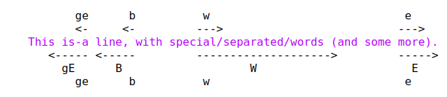
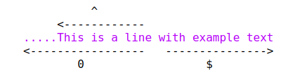

[toc]
# 初步知识

## vim初步

### 第一次运行vim

> vim file.txt

现在开始编辑一个名为file.txt的新文件。vim是一个文本编辑器，其编辑的都是文本文件。  
以波浪线开头的行表示该行在文件中不存在。当你在该行录入信息后前面的波浪线消失。  

### 插入文本

vim是一个多模式的编辑器，也就是说，在不同的模式下，编辑器的响应是不同的。   
普通模式下，你敲入的字符只是命令，而在插入模式下敲入的字符就是文本了。  
刚进入vim，它处于普通模式，通过敲入i a等命令就可以进入插入模式了。  
无论在什么模式下都可以使用Esc键来退出到普通模式。  

> 我们在什么模式？
> vim下有个showmode参数来在状态栏中显示目前的模式  
> :set showmode  
> 上述命令就可以实现，其意义是设置 showmode=true，在vim中不用显示也不能显示true这个赋值  
> :set noshowmode  
> 上述命令可以关闭showmode，其意义是设置 showmode=false 在vim中参数基本上都是这么赋值的

### 移动光标

普通模式，vim使用hjkl来移动光标。速记技巧：
| 快捷键 | 方向 | 速记             |
|--------|------|------------------|
| h      | 左   | 位于四键的最左侧 |
| j      | 下   | j向下有一个勾    |
| k      | 上   |                  |
| l      | 右   | 位于四键的最右侧 |

### 删除字符

- x 删除一个字符
- dd 删除一行
- J 删除一个换行符，通过J命令，可以将两行连起来。

### 撤销重做  

- u命令撤销上一次操作
- ctrl+r 重做
- U 行撤销，撤销所有在最近编辑的行上的操作。

### 进入插入模式的操作

| 快捷键 | 说明                         |
|--------|------------------------------|
| a      | append 在光标后插入文本      |
| A      | 在行末插入文本               |
| i      | insert 在光标前插入文本      |
| I      | 在行前插入文本               |
| o      | 在当前行下方开始新行插入文本 |
| O      | 在当前行上方开始新行插入文本 |

### 退出

- :w 保存文件
- :q 退出文件，如果未保持无法退出，可以在q后加！强制推出
- :wq 保存并推出
- ZZ 保存退出，与上面的区别是，上面的命令是命令行命令前要加:,而ZZ可以在普通模式下使用。
- :e! 放弃修改后重新装载原来的文件重新编辑

## 移动
在插入或者删除之前，你需要将光标移动到合适的位置，Vim中提供了大量命令来移动光标。  

### 词移动

- w 向后移动到一个词的词首
- b 向前移动到一个词的词首
- e 向后移动到一个词的词尾
- ge 向前移动到一个词的词尾

词语动特点：
- 词移动是可以跨行的。
- 对于. , / )等符号在词移动中默认相当于一个词。
- 词是使用空格来分割的，所以中文一个段落相当于一个词。



### 行首行尾移动

- $ 光标移动到当前行行尾
- ^ 光标移动到当前行非空字符
- 0 光标移动到当前行的第一个字符




### 移动到一个指定的字符

- f{char} 向后寻找本行中的一个字符
- F{char} 向前修找本行中的一个字符
- t{char} 与f相同，但是光标放到寻找到的字符的前一个字符上
- T{char} t的反向操作
- 上述四个命令可以通过";"分号键重复，通过逗号键反向重复
- 这四个命令都不会使光标移出本行  

### 括号匹配  

- % 匹配一对括号(大 中 小括号都可以)如果光标在"("上则移动到对应的")"上，如果在")"上则移动到对应的"("
- 当光标不再一个有用的字符上即不再"()"上时，会查找离他最近的一个"("无论这个在其前还是其后

### 移动到指定行

- nj 向下移动n行
- nk 向上移动n行
- nG 向下移动到第n行
- gg 移动到文件首行，等同于1G
- G 移动到最后一行  
- n% 移动到文件的某个位置，50%即移动到中间位置
- H 移动到屏幕的头部Home 屏幕是不动的
- M 移动到屏幕的中间部分Middle
- L 移动到屏幕的尾部Last   

> 相对行号和绝对行号  
> :set number   在vim中显示行号  
> :set relativenumber 在vim中显示相对行号  
> 使用G移动就是用到了绝对行号  
> 而使用j k移动就是使用了相对行号

### 滚屏

- ctrl-u 向上滚动半屏up
- ctrl-d 向下滚动半屏down
- ctrl-e 向上滚动一行
- ctrl-y 向下滚动一行
- ctrl-f 向上滚动一屏幕forward
- ctrl-b 向下滚动一屏幕backward
- zz 置光标所在行处于屏幕中间
- zt 置光标所在行处于屏幕顶部
- zb 置光标所在行处于屏幕底部
- 移动屏幕时如果光标所在行还在在屏幕内可见则光标不移动，如果不可见则光标移动

> :set scrolloff=5  
> 上述命令表示光标上下总保留5行处于视窗中用作上下文

### 简单查找

- /string 向下查找字符串
- ?string 向上查找字符串
- n 查找下一个
- N 与n相反

> :set ignorecase  
> 设置不区分大小写，默认情况下区分大小写
> :set hlsearch  
> 高亮匹配，如果想去掉高亮显示则 :nohlsearch  
> :set nowrapscan  
> 默认情况下查找到文件尾后会自动折反到文件头，该设置可以将wrapscan的状态设置为no，即不折反。  


### 使用标记

当使用G命令跳转到另一个地方时，vim会记住你从什么地方条过去的。这个位置成为一个标记，要回到原来的地方，使用``命令。  
vim中还允许你在文本中放置自定义的标记，命令ma用于a标记当前光标的位置。你可以在文本中定义26个标记(a-z)，这些标记是不可见的，只是一个由vim记住的位置。  
要跳转到一个你定义的标记处，可以使用`{mark}命令来实现。  
:marks命令获取所有的标记列表，在其中你可以看到一些特殊的内置标记:  

- `跳转前的光标位置  这也是为啥``可以跳转的原因
- "最后编辑的光标位置
- [最后修改的开始位置
- ]最后修改的结束位置

## 做小的改动

### 操作符与动作

操作符命令：一般用于删除、更改、复制等操作  
动作：出现在操作符之后，从而使操作符作用于被该动作所跨越的文本之上(也就是说在动作之前与之后的光标位置之间的文本上进行操作)  

常用的操作符命令：  
- c 更改 更改动作与删除动作不同的是完成操作后直接进入插入模式
- d 删除(剪切)
- y 复制  

动作：我们上面讲的h j k l光标移动，w b e ge词移动，$ ^行移动，f F搜索移动等命令都是动作  

实例：  
- dw 删除一个字符
- d2w 删除两个字符
- d$ 删除到到行尾
- y^ 复制光标到行首的字符
- d3l 向右删除3个字符
- dd 删除一整行
- yy 复制一整行
- cc 更改一整行
- df< 删除到找到第一个<处

一些特殊单字符命令：  
| 命令 | 说明           | 相当于的操作动作命令 |
|------|----------------|----------------------|
| x    | 删除光标下字符 | dl                   |
| X    | 删除左侧字符   | dh                   |
| D    | 删除到行尾     | d$                   |
| C    | 更改到行尾     | c$                   |
| S    | 更改一整行     | cc                   |

### 重复一个修改

"."是vim中非常重要的命令，它会重复最后一次的修改操作。（除了u撤销以及ctrl-r重做）  


### 文本对象  

如果在一个单词中要删除这个单词，可以使用dw，但是你必须移动到这个单词的首字母处。这个时候可以使用daw来完成这个操作，其中aw表示a word。(他们会删除这个单词以及单词后面的空格，如果光标位于首字母daw与dw操作结果相同)  
diw类似与daw不过他不会删除单词后的空格。相当于光标位于首字母位置的de命令。  
dis可以改变一个句子，句子使用句号分割。dis保留句子后的空格，as不保留空格。  
如果想要删除"" []等内的词，可以使用 di" di[表示 in "" in []

总结文本对象：  
- aw 表示a word 包括后续空格
- iw 表示is word 不包括后续空格
- is 表示一个句子，不包括句子后空格
- as 表示一个句子，包括句子后空格
- i“ 表示in "",包括在""内的内容


## 可视模式

要删除一些简单的的东西，用操作符-动作可以完成的非常好，但是在一些情况下，并不能容易确定用什么命令可以移动到你想要修改的地方，这个时候就可以使用可视模式了，可视模式比较类似于鼠标选取。  
使用v进入可视模式，在可视模式下可以使用 h j k l w b e ge gg G等所有移动光标的操作。当你这么做的时候被选中的文本会高亮显示，选择好了文本后最后执行d y c等操作符命令即可。  
使用V可以进入按行操作模式，噶模式下任何移动操作都会选择整行。  
使用ctrl-v可以进入列块选择模式，在变更一个类似表格的时候尤其有用，  
在可视模式下可以通过o命令来将光标在被选文字的两端来回移动  

总结： 
- v 可视模式
- V 按行选择
- ctrl-v 列块选择
- o 所选文字两端切换  

## 选项设置

vim可以按照你的需要进行设置。  
可能你已经厌倦了在命令行中输入常用到的命令，比如:set number等，vim提供了一个配置文件可以让vim用你习惯的设置启动。这个文件位于~/.vim/vimrc中。vim会在启动的时候执行这个文件里的命令。  
如果你已经有了vimrc文件，可以通过:edit $MYVIMRC来编辑他。  

### 选项示例  

- $MYVIMRC  表示本机的设置文件
- set nocompatible  不兼容vi，如果兼容有些vim操作无法执行
- set autoindent  使vim在启动一个新行的时候使用与前一行一样的缩进
- set backup  vim覆盖一个文件的时候保留一个备份，备份文件的名称为原来文件名上加~  
- set ruler  在vim窗口右下角显示当前光标的位置
- set showcmd  在vim窗口右下角显示未完成的命令
- map Q gq  简单的键盘映射


### 添加插件
vim可以通过插件增强功能，插件其实是一个当vim启动的时候能被自动执行的脚本。简单的将插件放入到vim的plugin目录中就可以使它生效。  
vim中有两种插件：  
- 全局插件：用于所有类型的文件
- 文件类型插件：仅仅用于特定类型的文件  

#### 全局插件
当你启动vim，他会自动加载这些插件。使用全局插件只需要两步：  
1. 获得一个插件的备份
2. 把他们放入plugin目录，该目录位于~/.vim/plugin  

#### 文件类型插件 
vim中包含了一套针对不同文件类型的插件，可以使用:filetype plugin on来启用他们。  
你也可以自行添加一个更好的或者vim缺少的文件类型插件，具体的安装方法与全局插件相同。

## 编辑多个文件
无论你有多少个文件，你都可以同时编辑他们而不需要退出vim，该章节介绍如何定义一个文件列表，并基于这个列表工作，或者从一个文件跳转到另一个文件，又或者从一个文件中拷贝文字，并写入到另一个文件中。  

### 编辑另一个文件  

- :edit other.txt 通过这个命令vim会关闭当前文件并打开一个新的文件。但如果当前文件没有保存，vim会提示错误而无法打开新的文件  
- :edit! other.txt 放弃当前文件保存并关闭当前文件，打开一个新的文件  

### 文件列表  

- vim file1.txt file2.txt file3.txt 在启动vim时可以指定一系列文件打开。  
- :next 默认情况下vim会显示第一个文件，可以通过next指令编辑第二个，next命令前可以加数字表示跳转到下几个，如果你没有保存也会报错，此时可以加!来强制进行，还有一个wnext命令可以执行一次写入操作然后next。
- :previous 与next相反其回到前一个文件，其也可以添加w前缀以及!强制进行  
- :args 在命令行中列出文件列表以及标识目前正在编辑的文件位置  
- :first 移动到列表中的第一个文件
- :last 移动到列表中的最后一个文件  
- :args file4.txt file5.txt 编辑另一个文件列表(不同与edit，使用args打开或新建的文件并不会关闭原来的文件)
- :args file3.txt 跳转到file3.txt文件上编辑
- :set autowrite 在跳转的过程中需要不断的存盘:w 否则你无法进入下一个，如果你想让vim自动存盘可以使用这条命令。
- 当你使用文件列表编辑文件的时候，vim假想你想编辑全部文件，为了防止你提前退出，如果你没有编辑过最后一个文件，当你退出的时候会提示错误信息。

### 备份文件  
默认情况下，vim是不会产生备份文件的。vim可以设置备份文件，他在你每次写入是备份下文件。

- :set backup 开启文件备份，默认备份文件文件名是在原始文件的后面加一个~
- :set backupext=.bak 如果不喜欢默认，可以使用这条语句来让备份文件后添加.bak

### 显示文件  

- vim -R file 以只读模式启动Vim，但是还是可以修改的，并且可以通过:w!来强制写入  
- vim -M file 真正的只读模式，不能以任何方式修改文件。

## 分割窗口  

### 分割窗口

- :split 将屏幕分割为上下两个窗口
- :split file.txt 用另一个指定的文件
- :new 在窗口编辑器中新建一个文件
- :vnew 垂直分割新建一个文件
- :vsplit 将屏幕分割为左右两个窗口
- :close 关闭窗口，使用:q ZZ也可以关闭，close可以避免你在剩余一个窗口的时候退出vim
- :only 关闭所有其他窗口

### 窗口大小

- ctrl+w + 扩大窗口
- ctrl+w - 缩小窗口
- 上面命令一次扩大缩小一行，可以 4ctrl+w + 来实现4行扩大
- 在vim中虽然所有操作都可以使用键盘完成，但是改变窗口大小需要按下很多键，可以使用鼠标在状态栏上拖动他们改变窗口大小

### 窗口间跳转以及移动窗口

- ctrl+w h 跳转到最左边的窗口
- ctrl+w j 跳转到最下边的窗口
- ctrl+w k 跳转到最上边的窗口
- ctrl+w l 跳转到最右边的窗口
- ctrl+w t 跳转到最顶上的窗口
- ctrl+w b 跳转到最底下的窗口
- ctrl+w H 把窗口移动到最左边
- ctrl+w J 把窗口移动到最下边
- ctrl+w K 把窗口移动到最上边
- ctrl+w L 把窗口移动到最右边

### 对所有窗口执行命令

- :qall 关闭所有窗口
- :wall 保存所有窗口
- :wqall 保存并关闭所有窗口
- vim -o one.txt two.txt three.txt 为每一个文件打开一个窗口,o表示水平 O表示垂直


### 标签页

窗口是用不重叠的，这样意味着如果打开过多窗口会很快用完屏幕空间。此时可以使用标签页来解决这个问题标签页可以容纳多个窗口，这种方式使你可以拥有多个窗口集合，每个集合下可以做不同的工作。  

- :tabedit thatfile 假设你在编辑thisfile文件，可以使用该命令打开thatfile文件，此时会在vim上方出现一个标签页
- :tabclose 关闭当前标签页
- :tabonly 关闭除了当前标签也以外的标签页
- :tabnext 切换到下一个标签页，如果在最后一个可以切换到第一个
- gt 普通模式命令，:tabnext先同，助记: go to
- gT 反向切换
- :tabdo cmd 对每个标签页执行命令


## 做大的改动

### 记录与回放命令

- . 点号命令重复前一个修改操作
- q{register} 启动一次键盘录入宏存入到寄存器中，寄存器可以用a~z中任意字母表示，再次按下q退出输入
- @{register} 执行该键盘录入宏

举例说明：  
```
stdio.h 
fchtl.h
stdlib.h
unistd.h

#想要变成

#include "stdio.h"
#include "fchtl.h"
#include "stdlib.h"
#include "unistd.h"
```
具体的步骤如下：
1. qa 启动记录，并保存至寄存器a中
2. ^ 移动到首行
3. i#include "esc 进入插入模式，输入#include "，退出插入模式
4. $ 移动到行尾
5. a"esc 进入追加模式写下"退出，也可以将第四步与第五步和并为 A"esc
6. j 移动到下一行
7. q 结束记录
8. 3@a 执行3次以上步骤完成  

### 读写文件的一部分

- :read filename 将另一个文件的内容插入到光标的下面
- :0read filename 插入到文件开头，$到文件结尾，read前是支持范围前缀的。

### 使用外部程序

- !ls 执行外部命令
- :read !ls 将ls的执行结果读进文件
- :$read !date 将时间插入到文件末


## 离开回来

### 挂起和继续  

- ctrl+z 可以挂起vim，允许你在启动vim的这个终端中运行其他命令
- fg 当你需要vim的时候，可以在终端中执行fg命令来返回被挂起的vim程序
- 注意如果你没有返回vim就关闭了终端，你的所有修改会被放弃


