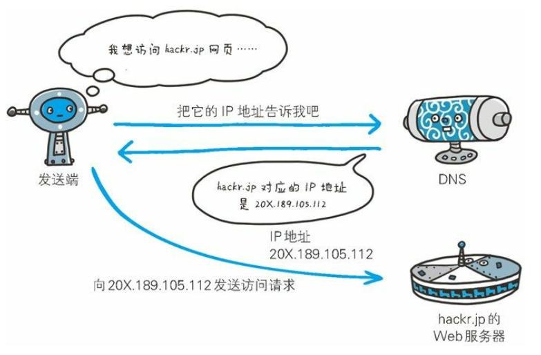
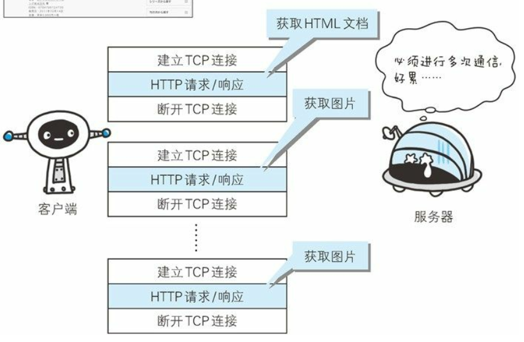
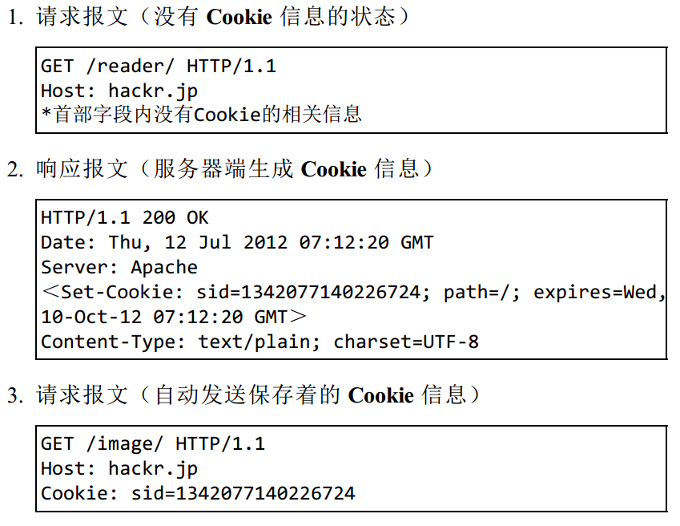

[toc]

# Web及网络基础

## 网路基础TCP/IP
我们当前使用的互联网是在TCP/IP协议族的基础上运作的。而HTTP属于它内部的一个子集。  
计算机与网络设备要相互通信，双方就必须基于相同的方法。比如：如何探测到通信目标、由哪一边先发起通信、使用哪种语言进行通信、怎么结束通信等规则都需要事先确定。而我们就把这种规则称为协议(protocol).  
而TCP/IP是互联网相关的各种协议族的总称。其下包含的协议有：IP DNS TCP UDP HTTP FTP等等。  

### TCP/IP的分层管理
TCP/IP协议族按层次分别分为：应用层、传输层、网络层和数据链路层。  
**应用层**  决定了向用户提供应用服务时通信的活动。包括FTP SMTP HTTP DNS等服务。    
**传输层**  对上层应用层提供处于网络连接中的两台计算机之间的数据传输。其包括两个性质不同的协议：TCP(传输控制协议)和UDP(用户数据报协议)    
**网络层**  用来处理在网络上流动的数据包。数据包是网络传输的最小数据单位。该层还规定了通过怎样的路径到达对方计算机，并把数据包传送给对方。      
**链路层**  用来处理连接网络的硬件部分。  

### TCP/IP通信传输流
  
以HTTP举例：  
1. 首先作为发送端的客户端在应用层(HTTP协议)发出一个想看某个Web页面的HTTP请求。  
2. 为传输方便，在传输层(TCP协议)把从应用层处收到的数据(HTTP请求报文)进行分割，并在各个报文上打上标记序号及端口号后转发给网络层。  
3. 在网络层(IP协议),增加作为通信目的地的MAC地址后转发给链路层。  
4. 接收端的服务器在链路层接收到数据，按序往上层发送，一直到应用层。  
  
重点：发送端在层与层之间传输数据时，每经过一层时必定会被打上一个该层所属的首部信息。反之，接收端在层与层传输数据时，每经过一层时会把对应的首部消去。

### 与HTTP相关协议
在TCP/IP协议族中有三个与HTTP密不可分的协议：IP TCP和DNS  
#### IP协议-负责传输
IP网络协议位于网路层。作用是把各个数据包传送给对方。而要保证确实传送到对方那里，则需要满足各类条件。其中两个重要的条件是：IP地址和MAC地址。  
IP地址指明了节点被分配到的地址，MAC地址是指网卡所属的固定地址。IP地址可以和MAC地址进行配对。IP地址可变换而MAC地址基本上不会更改。  
使用ARP协议凭借MAC地址进行通信：IP间的通信依赖MAC地址，在网路上，通信的双方通常不再一个局域网内，通常是经过多台计算机和网络设备中转才能连接到对方。而在进行中转时，会利用下一站中转设备的MAC地址来搜索下一个中转目标。而ARP就是一种用于解析地址的协议，根据通信双方的IP地址可以反查出对应的MAC地址。
  

#### TCP协议-可靠传输
TCP协议位于传输层，提供可靠的字节流服务。  
所谓字节流服务是指：为了方便传输，将大块数据分割成报文段为单位的数据包进行管理。而可靠的传输服务是指:能过将数据准确可靠地传给对方。  
为了准确无误地将数据送达目标，TCP协议采用三次握手策略：  
  
三次握手中使用了TCP的标志：SYN和ACK来完成。  
发送端首先发送一个带有SYN标志的数据包给对方，接收端收到后，回传一个带有SYN/ACK标志的数据包以示传达确认信息。最后，发送端再回传一个带ACK标志的数据包，代表握手结束。

#### DNS服务-域名解析
DNS服务位于应用层。它提供域名到IP地址之间的解析服务。  
用户通常使用主机名或域名来访问对方的计算机，而不是直接通过IP地址形式访问。因为IP地址是一组数字非常不好记，而用字母配合数字的表示形式来指定计算机名更符合人类的记忆习惯。而对于计算机去理解名字则是通过IP地址来进行的。为了解决上述矛盾，DNS服务器应运而生。

#### 总结 HTTP IP TCP DNS之间的关系

### URI和URL
URI是统一资源标识符，URL是统一资源定位符。URI用字符串标识某一互联网资源，而URL表示资源的站点。URL是URI的子集。  
URI的格式：  
  
- 协议方案名：获取访问资源时要指定协议类型http: ftp:等，也可使用data: javascript:这类指定数据或脚本程序的方案名。其不区分大小写，且最后附加一个冒号。  
- 登陆信息：指定用户名和密码作为从服务器端获取资源时必要的登陆信息。此项可选。
- 服务器地址：地址可以是DNS可解析名称或者IP地址
- 服务器端口号：指定服务器连接的网络端口号，可选项，若省略使用默认端口号
- 带层次的文件路径：指定服务器上的文件路径来定位特指的资源
- 查询字符串：针对已指定的文件路径内的资源，可以使用查询字符串传入任意参数，可选项。
- 片段标识符：通常用于标记出已获取资源中的子资源。可选项。

## HTTP协议简介
HTTP协议用于客户端和服务端之间的通信。他们通过请求和响应的交换达成通信。  

其中请求报文的具体构成如下所示：  
  
接收到请求的服务器，会将请求内容的处理结果以响应的形式返回:  
  

### HTTP是不保存状态的协议
HTTP无状态协议，HTTP协议自身不对请求和响应之间的通信状态进行保存。也就是说在HTTP这个级别，协议对于发送过的请求或相应都不做持久化处理。  
随着WEB的发展，因无状态而导致业务处理变得棘手，比如用户登录到一个购物网站，即使他们跳转到该站的其他页面后，也需要能继续保持登陆状态。但是如果HTTP是无状态的就必须重新登陆。针对这个实例，网站需要保存用户的状态。  
HTTP/1.1虽然也是无状态协议，但是为了实现期望的保存状态，引入的Cookie技术，有了Cookie再在HTTP协议通信，就可以管理状态了。  

### HTTP方法
|HTTP方法|说明|
|:------|:------|
|GET|GET方法本质就是发送一个请求来取得服务器上的某一资源。资源通过一组HTTP头和呈现数据返回给客户端|
|POST|POST方法向URL指定的资源提交数据或附加新的数据|
|PUT|跟POST方法类似，也是想服务器提交数据，但是，PUT指定了资源在服务器上的位置而POST没有|
|HEAD|HEAD方法只请求页面的首部|
|DELETE|DELETE方法删除服务器上的某资源|
|OPTIONS|OPTIONS方法用于获取当前URL所支持的方法|
|TRACE|TRACE方法用于激发一个远程的，应用层的请求消息回路|
|CONNECT|CONNECT方法把请求连接转换到透明的TCP/IP通道|

### 持久连接
HTTP协议的初始版本中，没进行一次HTTP通信就要断开一次TCP连接。比如，你浏览一个包含多张图片的HTML页面，在发送请求访问HTML页面资源的同时，也会请求该HTML页面里包含的其他资源。因此，每次的请求都会造成无畏的TCP连接建立和断开，增加通信量的开销。  
  
为了解决上述问题，HTTP/1.1提出了持久连接(HTTP keep-alive)的方法。持久连接的特点是，只要任意一端没有明确提出断开连接，则保持TCP连接状态：  
  
在HTTP/1.1中，所有的连接默认都是持久的。  

### 使用Cookie  
HTTP是无状态协议，它不对之前发生过的请求和响应的状态进行管理。而为了解决这个问题引入了Cookie技术。Cookie技术通过在请求和响应报文中写入Cookie信息来控制客户端的状态。  
Cookie会根据从服务器端发送的响应报文内的一个叫做Set-Cookie的首部字段信息，通知客户端保存Cookie。当下次客户端再往该服务器发送请求时，客户端会自动在请求报文内加入Cookie值后发送出去。服务器发现客户端发送过来的Cookie后，会去检查究竟从哪一个客户端发来的连接请求，然后对比服务器上的记录，最后得到之前的状态信息。

## HTTP报文信息
用于HTTP协议交互的信息被称为HTTP报文。客户端的HTTP报文叫做请求报文，服务器端的叫做响应报文。HTTP报文本身是由多行数据构成的字符串文本。  
HTTP报文大致分为报文首部和报文主体两块。两者由最初出现的空行来划分。  
  

### HTTP首部
HTTP协议的请求和响应报文中必定包含HTTP首部。首部内容为客户端和服务器分别处理请求和响应提供所需要的信息。对于客户端用户来说，这些信息中的大部分内容都无须亲自查看。  
报文首部由多个字段构成。  
在请求报文中，HTTP首部由方法、URI、HTTP版本、HTTP首部字段等组成。  
在响应报文中，HTTP首部由HTTP版本、状态码、HTTP首部字段组成。

#### HTTP首部字段
首部字段结构：
> 首部字段名:字段值1,字段值2  

5种首部字段类型：
- 通用首部字段

- 请求首部字段

- 响应首部字段

- 实体首部字段

- 其他首部字段
    - 为Cookie服务的首部字段
    虽然没有被编入HTTP/1.1的标准化文件中，但是在Web网站方面得到了广泛的应用。  
    

#### HTTP状态码
HTTP状态码负责表示客户端HTTP请求的返回结果、标记服务器端的处理是否正常、通知出现的错误等工作。  
状态码类别:  
  
常用的状态码:
- 200 OK - 表示从客户端发送来的请求在服务器端被正常处理了
- 204 No Content - 该状态码表示服务器接收到请求并成功处理，但是返回的响应报文中不含实体的主体部分。  
- 301 Moved Permanently - 永久性重定向，表示请求的资源已经被分配到了新的URI
- 302 Found - 临时重定向 
- 304 Not Modified - 表示客户端发送附带条件的请求时，服务器端允许请求访问资源，但是未满足客户端的条件
- 400 Bad Request - 表示请求报文中存在语法错误
- 403 Forbidden - 表明请求的资源的访问被服务器拒绝  
- 404 Not Found - 无法找到该资源

## 与HTTP协助的WEB服务器
HTTP通信时，除了客户端和服务器以外，还有一些用于通信数据转发的应用程序，例如代理、网关和隧道。他们可以配合服务器工作。  
代理:代理是一种有转发功能的应用程序，它扮演了位于服务器和客户端中间人的角色，接收由客户端发送的请求并转发给服务器，同时也接收服务器返回的响应并转发给客户端。  
网关：网关是转发其他服务器通信数据的服务器，接收从客户端发送来的请求时，它就像自己拥有资源的源服务器一样对请求进行处理，有时客户端可能都不会察觉，自己的通信目标是一个网关。  
隧道：隧道是在相隔甚远的客户端和服务器两者之间进行中转，并保持双方通信连接的应用程序。  

### 代理
代理服务器的基本行为就是接收客户端发送的请求后转发给其他服务器。代理不改变请求的URI，会直接发送给前方持有资源的目标服务器。  
在HTTP通信过程中，可级联多台地理服务器。请求和响应的转发会经过数台类似锁链一样连接起来的代理服务器。转发时，需要附加Via首部字段以标记出经过的主机信息。
   
代理有多种使用方法，按照两种基准分类：一种是是否适用缓存，一种是是否修改报文。  
缓存代理：代理转发响应时，缓存代理会预先将资源的副本保存在代理服务器上。  
透明代理：转发请求或响应时，不对报文做任何加工的代理类型被称为透明代理。反之为非透明代理。

### 网关

网关的工作机制和代理相似，而网关能使通信线路上的服务器提供非HTTP协议服务。  
利用网关能提高通信的安全性，因为可以在客户端与网关之间的通信线路上加密以确保连接的安全。比如网关可以连接数据库，使用SQL语句查询数据。另外在WEB购物网站上进行信用卡结算时，网关可以和信用卡结算系统联动。

### 隧道
隧道可 按要求建立起一条与其他服务器的通信线路，届时使用SSL等加密手段进行通信，隧道的目的是确保客户端能与服务器进行安全的通信。隧道本身不会去解析HTTP请求，也就是说，请求保持原样中转给之后的服务器。隧道会在通信双方断开连接时结束。

## Web安全通信HTTPS
在HTTP协议中有可能存在信息窃听或身份伪装等安全问题，使用HTTPS通信机制可以有效地防止这些问题。  
HTTP的不足：
- 通信使用明文，内容可能被窃听  
- 不验证通信方的身份，因此有可能遭遇伪装
- 无法证明报文的完整性，所以有可能已经遭到篡改

通信加密：HTTP协议中没有加密机制，但可以通过和SSL或TLS的组合使用，加密HTTP的通信内容。  
用SSL建立安全通信线路之后，就可以在这条线路上进行HTTP通信了。与SSL组合使用的HTTP被称为HTTPS。  
为了做到有效的内容加密，前提是要求客户端和服务器同时具备加密和解密机制，主要应用在Web服务中。

## 用户身份认证
HTTP使用的认证方式: 
- BASIC认证
- DIGEST认证
- SSL客户端认证
- 基于表单认证  

### BASIC认证  
   
1. 当请求的资源需要BASIC认证时，服务器会随状态码401 Authorization Required，返回WWW-Authenticate首部字段的响应。该字段内包含认证的方式(BASIC)及Request_URI安全域字符串(realm)。  
2. 接收到状态码401的客户端为了通过BASIC认证，需要将用户ID及密码发送给服务器。发送的字符串内容是由用户ID和密码构成，两者中间以冒号连接后再经过Base64编码处理。(假设用户ID为guest，密码为guest，连接起来就会形成guest:guset这样的字符串，然后经过Base64编码，最后的结果即是Z3V1c3Q6Z3V1c3Q=，把这个字符串写入首部字段Authorization后，发送请求)。  
3. 接收到包含首部字段Authorization请求的服务器，会对认证信息的正确性进行验证。如验证通过，则返回一条包含Request-URI资源的响应。(BASIC认证虽然采用Base64编码方式，但这不是加密处理，不需要任何附加信息就可以对其解码。因此并不是安全的)  

### DIGEST认证
为了弥补BASIC认证存在的缺点，有了DIGEST认证。该认证同样使用质询/响应的方式。但是不会像BASIC那样直接发送明文密码。  
  
1. 当请求的资源需要认证时，服务器会随状态码401 Authorization Required，返回WWW-Authenticate首部字段的响应。该字段内包含质问响应方式认真所需的临时质问码(随机数nonce) 
2. 接收到 401 状态码的客户端，返回的响应中包含DIGEST认证必须的首部字段Authorization信息。首部字段Authorization内必须包含username、realm、nonce、uri和response的字段信息。其中，realm和nonce就是之前从服务器接收到的响应中的字段。username是realm限定范围内可进行认证的用户名。uri（digest-uri）即Request-URI的值，但考虑到经代理转发后Request-URI的值可能被修改，因此事先会复制一份副本保存在uri内。response 也可叫做Request-Digest，存放经过 MD5 运算后的密码字符串，形成响应码。  
3. 接收到包含首部字段 Authorization 请求的服务器， 会确认认证信息的正确性。 认证通过后则返回包含 Request-URI 资源的响应。(DIGEST 认证和 BASIC 认证一样， 使用上不那么便捷灵活， 且仍达不到多数 Web 网站对高度安全等级的追求标准。 因此它的适用范围也有所受限。)

### 基于表单认证
基于表单的认证方法并不是在HTTP协议中定义的。客户端会向服务器上的Web应用程序发送登陆信息，按登陆信息的验证结果认证。根据Web应用程序的实际安装，提供的用户及认证方式也各不相同。  
由于使用上的便利性及安全性问题，HTTP协议标准提供的BASIC认证和DIGEST认证几乎不怎么实用。所以目前都是使用由Web应用程序各自实现基于表单的认证方式。  

#### Session管理及Cookie应用
基于表单认证的标准规范尚未定论，但是一般会使用Cookie来管理Session(会话)。  
基于表单认证本身是通过服务器端的Web应用，将客户端发送过来的用户ID和密码与之前登陆过的信息做匹配来进行认证的。  
但是鉴于HTTP是无状态协议，之前已认证成功的用户状态无法通过协议层面保存下来，也无法区分他与其他的用户。于是我们会使用Cookie来管理Session，以弥补HTTP协议中不存在的状态管理功能。  
   
1. 客户端把用户ID和密码等登陆信息放入报文的实体部分，通过POST方法把请求发送给服务器。而这时，会使用HTTPS通信来进行HTML表单画面的显示和用户输入数据的发送。  
2. 服务器会发放用以识别用户的Session ID。通过验证从客户端发送过来的登陆信息进行身份认证，然后把用户的认证状态与Session ID绑定后记录在服务器端。向客户端返回响应时，会在首部字段Set-Cookie内写入Session ID.可以将Session ID想象成一种用于区别不同用户的等位号。(如果Session ID被第三方盗走，对方就可以伪装成你的身份进行操作)  
3. 客户端接收到从服务器发送的Session ID后，会将其作为Cookie保存在本地，下次向服务器发送请求时，浏览器会自动发送Cookie，所以Session ID也随之发送到服务器。服务器端可通过验证接收到的Session ID识别用户和其认证状态。