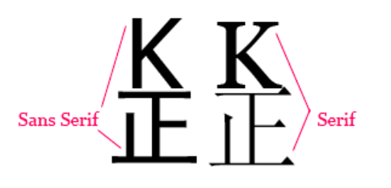

[toc]
# css简介

## css概述
- css是Cascading Style Sheets的简称，即层叠样式表
- css用于定义如何显示HTML元素，用于解决内容与表现分离的问题
- css允许以多种方式定义样式，可以位于html元素中、位于head元素内定义或则一个外部css文件
- 多个样式定义会**层叠**为一

### 样式为解决的问题
HTML标签原来被设计为用于定义文档的内容。通过h1 p table告诉浏览器这是标题、段落、表格之类的语义信息，而文档的具体布局html并不关心。但是为了格式化文档，浏览器厂家不断的向html添加类似font等样式标签，这样就违背了html的初衷，并且html规范也变得越来越复杂，创建文档内容清晰地独立于文档表现层的站点变得越来越困难。  
为了解决这个问题，W3C组织就创建了CSS来专门用于制定网页样式  

###多重样式将层叠为一个
样式表允许以多种方式规定样式信息，样式可以规定在单个HTML元素中，在HTML的头元素中，或者一个外部的CSS文件中。设置可以在同一个HTML文档内部引用多个外部样式表。  

> 当同一个HTML元素被不止一个样式定义时，如何决定使用哪个样式呢？  
> 一般而言样式表现有四种情况，具体优先权如下：  
> 1.浏览器缺省设置  
> 2.外部样式表  
> 3.内部样式表(位于head标签内)  
> 4.内联样式(在html元素内，定义在该元素开始标签中)  

## css基本语法

### css语法
css规则由两个主要的部分组成：选择器，以及一条或多条声明，声明又由一个属性和一个值组成。多个声明之间使用分号隔开。  

> selector {property:value; property:value;...}


## css样式属性

### css字体  
css字体属性中定义了文本的字体系列、大小、粗细、风格和变形。  

1. font-family 指定字体系列即指定文字的字体
    1. font-family:"微软雅黑"; **正常情况下，属性值不需要加引号，但是如果属性值是中文，或属性值中包含一个或多个空格，以及包含\#或$等符号，就需要加引号**
2. font-style 指定字体的风格，其包含一下二个属性值：
   1. normal 正常显示，默认
   2. italic 斜体
3. font-weight 设置文件的粗细，其包含以下值：
   1. 100～900为字体添加9级的粗细度
   2. normal 等价400 默认
   3. bold 等价700 加粗
   4. bolder 浏览器会设置比继承值更粗的一个字体加粗
   5. lighter 浏览器将设置比继承值更细的一个字体
4. font-size 字体大小
   1. 绝对值
      1. 将文本设置为指定的大小 例如 60px
      2. 不允许用户在所有浏览器中改变文本大小(不利于可用性)
      3. 绝对大小在确定了输出的物理尺寸时很有用
   2. 相对大小
      1. 想对于周围元素来设置大小
      2. 允许用户在浏览器改文本大小
   3. 默认值：如果没有规定文字大小，普通文本(例如p元素内容)的默认值是16px  
5. font 简写属性，作用是将所有针对字体的属性设置在一个声明中。
   1. font:italic bold 10px "SumHei"
   2. 这种缩写形式style weight可以省略并且交换位置
   3. size family不能省略并且不能交换位置，并且必须位于最后

> 重点设置字体大小的单位：  
> 1.使用px设置大小。  
> 通过像素设置大小，可以对文本大小进行完全控制，虽然可以通过浏览器的缩放工具调整文本大小（IE浏览器不支持）但这实际上是对整个页面的调整，而不仅限于文本。  
> 2.使用em来设置字体大小  
> 1em等于当前的字体尺寸，如果一个元素的font-size为16px，那么对于该元素，1em就等于16px。在设置字体大小时，em的值会相对于父元素的字体大小改变。  
> 浏览器中默认的文本大小是16px，因此1em的默认尺寸就是16px。  
> 假设父元素的font-size设置为20px，那么想对于子元素中1em就等于20px。  
> 使用em在首行缩进两个字符的时候会非常有用，因为你无法使用px来精确两个字符。 

> 指定字体系列  
> 设置字体时，如果本机中没有该字体，那么将显示浏览器默认的字体。  
> 如果不想让浏览器显示默认字体我们可以指定多个字体。  
> 例如： font-family:"Times","Microsoft Yahei"  
> 在指定时有一个技巧，可以在第一个写英文字体，后面写中文字体，这样就可以同时指定英文和中文字体了(因为英文字体都无法表现中文，而中文字体都可以表现英文)  


> web中字体规定的字体系列  
> 在web中规定了5种通用的字体系列：  
> 1.Serif字体：这类字体成比例(成比例的意思是字体中的所有字符根据其不同的大小有不同的宽度，例如i与m的宽度是不同的。)，而且有衬线(衬线是每个字符笔画末端的装饰)。  
> 1.1 这类字体包括：英文：Georgia\Times New Roman  中文：宋体  
> 1.2 因为衬线字体的可读性非常好，所以它应用最多的地方是正文内容等以大段文字作为表现形式的作品上。  
> 2.Sans-serif字体：这类字体也是成比例的，但是没有衬线  
> 2.1 这类字体包括：英文：Arial Tahoma Verdana 中文：黑体 微软雅黑 幼圆  
> 2.2 该类字体比较醒目，常用在标题、表格等需要显著醒目但不必长时间阅读的地方  
>   
> 3.Monospace字体：该字体并不成比例，通常用于模拟打印机打出的文本。在老式打印机的输出要求每个字符的宽度是完全相同的。我们将这些字符宽度相同的字体统一归为Monospace字体，不论他们是否有衬线。  
> 3.1 这类字体包括：Courier\Courier New\Andale Mono  
> 3.2 因为字符宽度一致，所以特别容易对齐，能够精确的定位某行某列，因此经常用于显示代码。  
> 4.Cursive字体：这类字体试图模仿人的手写体。  
> 4.1 这类字体包括：Zapf Chancery\Author\Comic Sans 中文：华文行草  
> 5.Fantasy字体：这些字体无法用任何特征来定义，只有一点确认的，那就是我们无法很容易的将他们规划到任何一个其他的文字体系中。

### css文本
通过文本属性，可以改变文本的颜色、字符间距、对齐文本，对文本进行缩进等操作。  

1. text-indent 文本缩进
   1. text-indent:2em  首行缩进两字符。如果是负数就是悬挂缩进
   2. 一般来说，可以为所有的块级元素应用text-indent,但是无法将该属性用于行内元素，图像之类的替换元素也无法应用text-indent属性，不过，如果一个块级元素(比如段落)的首行中有一个图像，它会随该行的其余文本移动
   3. 如果想把一个行内元素的第一行缩进，可以用左边距或外边框创造类似的效果。
   4. 可以使用百分比相对于缩进父级元素的宽度
2. text-align 水平对齐其中包含4个属性值：
   1. left right center justify 分别表示 左对齐 右对齐 居中 两端对齐
3. text-decoration 文本装饰，其中包括五个属性值:
   1. none - 关闭所有装饰，例如链接默认情况下会有一个下划线，可以用该属性值关闭
   2. underline - 对元素添加下划线
   3. overline - 对元素添加上划线
   4. line-through - 对元素添加删除线
   5. blink - 文本闪烁
4. color 设置文本字体颜色
   1. color_name 使用英文颜色名表示 red green等
   2. hex_number 使用十六进制表示 ##ff0000 #f00
   3. rgb_number 使用rgb颜色空间表示 rgb(255,0,0)
   4. 带透明度的rgb rgba(255,0,0,0.5) 其中a取值0~1 用于表示完全透明到不透明
5. word-spacing 改变字之间的标准间隔，默认值为normal或者0  
   1. 值 0.5em -10px等
6. letter-spacing 改变字母的间隔，值与上相同
7. white-space 用于处理空白符 空格 换行(回车) tab
   1. normal - 默认，默认情况下浏览器会把所有空白符合并为一个空格
   2. pre - 所有的空格 回车 tab被保留
   3. nowrap - 防止元素中的文本换行，除非使用了br元素
   4. pre-wrap - 设置该元素中的文本会保留空白序列的同时文本可以正常换行
   5. pre-line - 保留空白序列的同时，保留换行符

### css背景
css允许应用纯色作为背景，也允许使用背景图像创建相当复杂的效果。  
1. background-color 设置背景颜色
   1. 可以为所有元素设置背景色
   2. 背景色不能继承
   3. 其默认值为transparent 即透明的意思
2. background-image 背景图像
   1. 默认值为none 表示不放置任何背景图像
   2. url(/image/example.gif)  接受一个url值
   3. 背景图像也不能被继承
3. background-repeat 如果想要让背景图像进行平铺，可以使用该属性
   1. 该属性是与background-image配合使用的，默认情况下背景图像不平铺
   2. repeat-x 图像水平重复
   3. repeat-y 图像垂直重复
   4. no-repeat 图像不平铺
4. background-position 背景定位，改变图像在背景中的位置
   1. top right 放置在元素的右上角
   2. center center 放置在中间
   3. top center 放置在元素中间上方
   4. right  等价于right center 
   5. 如果只写top bottom right left 则默认后面是center
   6. 还可以是百分比数值，0% 0% 位于左上角 100% 100% 位于右下角
   7. 可以是长度值 0px 0px 左上角  右下角为最大
   8. 通过百分比或则长度值可以实现精灵图操作
5. background-attachment 通过这个属性，可以声明图像相对于可视区是固定的，不收滚动印象
   1. fixed 固定

## css选择器
[所有选择器列表](https://www.w3school.com.cn/cssref/css_selectors.asp)
### 元素选择器
css中最常见的就是元素选择器。通过元素标签名称来直接选择某个html元素  
其注意点：  
1. 元素选择器选中的是当前界面中该标签的所有元素，而不能单独选择某一个元素
2. 元素选择器无论该元素位于多么深层的嵌套都会被选中

#### 选择器分组
多个选择器可以放置在一起，然后用逗号分隔，其右边定义的所有规则都将引用到左边的选择器所选择的元素中。

```css
html {color:black;}
h1 {color:blue;}
h2,p,table,th,td,pre {font-size:20px}
```

### id选择器
使用id来进行元素的选择。  
语法：*#id_name {font-weight:bold;} 其中前面的\*通配符可以省略  
其注意点如下：  
1. 每个html标签都有一个属性叫做id，可以用于设置id
2. 在同一个界面下，id的名称是不能重复的
3. id选择器是在id名称前加*#来设置的，其中*通配符可以省略
4. id的名称是有一定规范的
   1. id的名称只能包含数字、字母、下划线，并且不能由数字开头
   2. id名称不能是html标签的名称
   3. id是区分大小写的
5. 在实际开发中，一般情况下如果是仅仅用于设置页面样式我们是不适用id的。因为在前端开发中id通常是留给js使用的

```css
*#idname1 {color:red;}
#idname2 {color:yellow;}
```

### 类选择器
类选择器是最常使用的选择器，其可以在不考虑具体设计的元素的情况下应用样式。  
在使用类选择器之前，需要将类选择器与元素关联，使用class指定一个名字，就是类名了。  
每个元素都有一个class属性用于指定类。  
```html
<h1 class="important">
   this heading is very important.
</h1>
<p class="important">
   this paragraph is very important.
</p>
<p class="important warning">
   this paragraph is a very important warning.
</p>

<style>
   *.important {color:red;}
   p.important {color:green;}
   .important.warning {color:yellow;}
</style>
```
类选择器总结：  
1. 使用.加类名来选择所有由该类标识的元素
2. 可以结合元素选择器、类选择器等其他选择器来选择你想要的元素。p.important即匹配class属性包含important的所有p元素。
3. 一个class属性可以有多个值，中间使用空格隔开。即每个元素可以同时绑定多个类名 
4. 类名的命名规范同id的命名规范

#### id选择器与类选择器区别

1. id只能在文档中使用一次
   1. id相当于人的身份证是唯一的，表现在html文档中就是id选择器会使用一次且仅一次
   2. class相当于人的姓名，并不是唯一的，所以可以在所有元素中应用
2. 不能使用id词列表
   1. 一个元素可以以空格分隔的词列表来使用多个类标识
   2. 而id仅仅只能有一个
3. 选择器标识符不一样
   1. class选择器以.开头
   2. id选择器以#开头
4. 使用环境不同
   1. 一般设置样式都使用类选择器
   2. 而在企业开发中，id一般是留给js使用的


### 后代选择器
后代选择器用于选择某元素的后代的元素。  
注意：其后代是并不仅仅是其子代，无论嵌套的多么深都属于后代。  
语法： 父类元素选择器 后代元素选择器 {属性}  其中间以空格作为分隔  

``` html
<style>
   h1 em {color:red;}
   /* 注意 不仅仅可以使用元素选择器，还可以使用其他选择器来对应后代关系 */
</style>
<h1>This is a <em>important</em> heading</h1>
<p>This is a <em>important</em> paragraph.</p>
```

### 子元素选择器
与后代选择器相比，子元素只能选择作为某个子元素的元素。  
语法：父类元素选择器 > 子类元素选择器 {属性}  
注意点：其仅仅选择元素的子类，要想选择嵌套多层的元素请使用后代选择器  

> table.company td > p  
> 上面的选择器表示，选择定义了class为company的table元素内的所有td元素下的p子元素。  
> 或者说：选择一个p元素，其子元素为td，而该td位于table下，并且这个table被class="company"修饰

### 交集选择器
选择两个选择器下的交集。  
语法：选择器1选择器2 {属性}  

> p.important  //意思为选择所有定义了 class="important" 的p标签  
> .important //实际上为*.important 而*通配符表示所有元素，可以省略  

### 并集选择器
选择多个选择器下的并集。  
语法：选择器1,选择器2,...{属性}  
通常我们也称为选择器分组。  

### 相邻兄弟选择器  
相邻兄弟选择器可选择紧紧接在另一个元素后的元素，并且二个元素拥有相同的父元素。  
语法：选择器1+选择器2 {属性}  

> h1 + p {margin-top:50px;} #意思为选择紧接在h1元素后出现的p元素  

``` html
<div>
  <ul>
    <li>List item 1</li>
    <li>List item 2</li>
    <li>List item 3</li>
  </ul>
  <ol>
    <li>List item 1</li>
    <li>List item 2</li>
    <li>List item 3</li>
  </ol>
</div>

<style>
   li + li {color:red;}
   /* 上面的选择器只会把列表中的第二个和第三个列表项变为红色，第一个列表项不受影响 */
</style>
```

### 通用兄弟选择器
语法：选择器1~选择器2{属性}  
意思是，选择选择器1下面的所有选择器2同类。其特点是选择器2中的元素是位于选择器1下面的，并且选择器2与选择器1拥有相同的父元素。  

相邻兄弟选择器仅仅选择紧挨着的下一个元素，而通用兄弟选择器不要求紧挨、只要是位于其下的所有兄弟就好了。

### 序选择器
是css3中定义的一共10个，其中包含两大类：  
1. 选择同级别的第几个
   1. :first-child 选中同级别的第一个标签 针对于下面的html即选择了h1 以及嵌套在div中的第一个p
      1. :first-child {color:red;} 将h1以及div中嵌套的第一个p改为红色
      2. p:first-child {color:red;} 会将嵌套在div中的p字体改为红色
   2. :last-child 选中同级别的最后一个标签
      1. 针对于下面的html就是 div标签以及嵌套在div中的段落3
   3. :nth-child(n) 选择同级别中的第n个标签
      1. 如果为n=3，在下列的html中选中的是 段落2以及嵌套在div中的段落3
   4. :nth-last-child(n) 选中倒着数第几个标签
   5. :only-child 选中同级别中只有一个元素的元素 
      1. 下面的html中没有一个可以被选中
2. 选择同类型的第几个
   1. :first-of-type 选中同级别中同类型的第一个,针对于下面的html选择了h1 段落1 以及嵌套在div中的段落1
      1. p:first-of-type {color:red;} 选中了两个段落1将其改为红色
   2. :first-of-type 选中同级别中同类型的最后一个
      1. 针对于下面的html为h1 段落3 div 以及嵌套在div中的段落3
   3. :nth-of-type(n) 选中同级别中同类型的第n个
      1. 如果n=3 则选中下列的两个段落3
   4. :nth-last-of-type(n) 选中倒着数同级别中同类型的第n个
   5. :only-of-type 选中同级别下中只有一个类型的元素
      1. 下面的html中h1 div会被选中
   6. 注意其中的n可以是odd表示奇数 even表示偶数 2n+1(n从0~标签数递增)

```html
<h1>标题</h1>
<p>段落1</p>
<p>段落2</p>
<p>段落3</p>
<div>
   <p>段落1</p>
   <p>段落2</p>  
   <p>段落3</p>
</div>
```

### 属性选择器
根据指定的属性名称找到对应的元素。  
1. [attribute] 选择所有定义了attribute属性的元素
2. [attribute=value] 选择所有定义了attribute属性并且值为value的元素，最常用的是用来找到input元素的。
3. 属性取值是以什么开头的
   1. [attribute|=value] css2中定义，只能找到以-隔开的字符，反正就是不能全部匹配
   2. [attribute^=value] css3中定义，用于取代上面的，可以正确匹配
4. 属性取值是以什么结尾的
   1. [attribute$=value] 
5. 属性的取值是否包含某个特定的值
   1. [attribute~=value] css2中定义，只能找到独立的单词，并且该单词由空格隔开
   2. [attribute*=value] css3中定义，取代css2中的


### 通配符选择器
> * 通配符选择器，用于该页面的所有元素  
> 由于通配符选择器是设置界面上所有的标签的属性，所以在设置之前会遍历所有的标签，如果当前界面上的标签比较多，那么性能会比较差，所以在实际开发中一般不使用通配符选择器。

## css三大特性

### 继承性  
给我们的父元素设置了一些属性，子元素也继承了这些属性。这就是继承性。  
1. 并不是所有的属性都可以继承，只有color/font-/text-/line-开头的属性才可以继承。
2. 在css的继承中，不仅仅是子元素可以继承，其后代都可以继承。
3. css继承性中的特殊性
   1. a标签的文字颜色和下划线是不能继承的
   2. h标签的文字大小是不能继承的
   3. 即通过给a标签的父元素设置文字颜色和下划线是不会影响a标签的。h同理。

应用场景：用于设置网页上的共性信息，例如网页的文字、大小、颜色。(通常设置在body中)

### 层叠性
如果一个元素被多个样式定义，浏览器根据一些规则来应用一个特定的样式。  
其层叠规则如下：
1. 不同样式表的层叠优先级
   1. 浏览器缺省 
   2. 外部样式表
   3. 内部样式表定义在head元素内的style元素
   4. 内联样式，定义在标签内部的style属性
2. 同样式表的层叠优先级
   1. 其他详见优先级

### 优先级
优先级就是浏览器如何处理层叠的。  
1. 直接选中优先级最大(间接选中就是通过继承得到的属性)
2. 如果是间接选中，那么就是谁离目标标签比较近就听谁的
3. 如果都是直接选中，并且是同类型的选择器那么谁写在后面就听谁的
4. 如果是直接选中，并且不是相同类型的选择器，那么就会按照选择器的优先级来层叠
   1. id>类>元素>通配符>继承>浏览器默认
5. 通过!important标签用于提升某个直接选中标签的选择器中的某个属性的优先级，将其调整为最高。
   1. color:green !important;
   2. 通配符选择器也是直接选中的。
   3. !important必须写在属性值分号前面，并且前面的!不能省略
6. 权重问题
   1. 当多个选择器混合在一起使用直接选中时，可以通过计算权重来判断谁的优先级最高
      1. 首先计算id选择器，后看类选择器，再看元素选择器以此类推 如果都一样谁写在后面听谁的

## 块级元素及行内元素  
在html中，大多数html元素被定义为块级元素或内联元素。  
特点是:
1. 块级元素
   1. 块级元素单独占领一行或则说浏览器默认会在块级元素后开始新行。
   2. 块级元素中可以嵌套其他所有的标签元素  
   3. 块级元素包括：div h ul ol dl li table 等
   4. 如果没有设置宽度，默认与父元素一样，如果设置了宽高，那么就按照设置的来
2. 内联元素
   1. 内联元素在显示时通常不会以新行开始  
   2. 内联元素中只能嵌套 文字/超链接/图片 这些元素(如果真要放置是层级结构可能与你设想的不一样)
   3. 内联元素包括:span b td a img p 等
   4. 如果没有设置宽度，默认和内容一样宽。并且行内元素不能设置宽度和高度
3. 行内块级元素
   1. 为了解决让元素即能够不独占一行，并且还可以设置宽度和高度。就可以将其设置为行内块级元素

### css元素显示模式  
- display属性：
  - inline 设置为行内元素
  - block 设置为块级元素
  - inline-block 设置为行内块级元素

